# Projektdokumentation - Outfitr

## Inhaltsverzeichnis

1. [Ausgangslage](#1-ausgangslage)
2. [Lösungsidee](#2-lösungsidee)
3. [Vorgehen & Artefakte](#3-vorgehen--artefakte)
   - [3.1 Understand & Define](#31-understand--define)
   - [3.2 Sketch](#32-sketch)
   - [3.3 Decide](#33-decide)
   - [3.4 Prototype](#34-prototype)
   - [3.5 Validate](#35-validate)
4. [Erweiterungen](#4-erweiterungen)
5. [Projektorganisation](#5-projektorganisation)
6. [KI-Deklaration](#6-ki-deklaration)
7. [Anhang](#7-anhang)

## 1. Ausgangslage

Im Alltag besitzen viele Menschen eine grosse Anzahl an Kleidungsstücken, haben jedoch trotzdem Schwierigkeiten, schnell passende Outfits zusammenzustellen. Besonders im hektischen Alltag führt dies häufig zu Unsicherheit, Entscheidungsstress und Zeitverlust. Zusätzlich fehlt oft der Überblick über den eigenen Kleiderschrank, wodurch vorhandene Kleidung ineffizient genutzt wird.

Digitale Lösungen im Bereich Kleiderverwaltung fokussieren sich häufig hauptsächlich auf die Organisation von Kleidung, bieten jedoch nur eingeschränkte Unterstützung bei der eigentlichen Outfit-Auswahl. Moderne Anwendungen mit KI-Ansätzen liefern zwar teilweise Outfit-Vorschläge, diese wirken jedoch oft wenig personalisiert oder nicht ausreichend alltagstauglich.

Das Projekt „Outfitr“ verfolgt deshalb das Ziel, eine moderne und benutzerfreundliche Webapplikation zu entwickeln, welche Nutzerinnen und Nutzer bei der Verwaltung ihres digitalen Kleiderschranks sowie bei der schnellen Erstellung passender Outfit-Kombinationen unterstützt.

#### Problem:

Viele Menschen haben Schwierigkeiten, passende Outfits aus ihrer vorhandenen Kleidung zusammenzustellen. Eine grosse Auswahl an Kleidungsstücken führt häufig zu Entscheidungsstress, Unsicherheit und ineffizienter Nutzung der vorhandenen Kleidung. Zusätzlich fehlt oft eine übersichtliche digitale Organisation des eigenen Kleiderschranks.

#### Ziele:

- Digitale Verwaltung des eigenen Kleiderschranks ermöglichen
- Übersicht über vorhandene Kleidung schaffen
- Schnelle Outfit-Kombinationen generieren
- Benutzerfreundliche und moderne Bedienung bieten
- Lieblings-Outfits speichern und organisieren
- Die Outfit-Auswahl im Alltag vereinfachen

#### Primäre Zielgruppe:

Die primäre Zielgruppe besteht aus Studierenden, jungen Erwachsenen sowie berufstätigen Personen mit wenig Zeit, die ihren Kleidungsstil einfacher organisieren und schneller passende Outfit-Kombinationen finden möchten.

#### Weitere Stakeholder:

Weitere Stakeholder sind potenzielle zukünftige Nutzerinnen und Nutzer der Anwendung sowie Personen mit Interesse an digitalen Lifestyle- und Organisationslösungen.

## 2. Lösungsidee

Die Lösungsidee von „Outfitr“ besteht aus einer modernen Webapplikation, welche Nutzerinnen und Nutzer bei der digitalen Organisation ihres Kleiderschranks sowie bei der Erstellung passender Outfit-Kombinationen unterstützt. Ziel ist es, den Prozess der Outfit-Auswahl im Alltag einfacher, schneller und übersichtlicher zu gestalten.

Die Anwendung ermöglicht es, Kleidungsstücke mit Informationen wie Kategorie, Farbe, Stil und Bild zu erfassen und zentral zu verwalten. Basierend auf den gespeicherten Kleidungsstücken können mithilfe eines Outfit-Generators passende Outfit-Kombinationen erstellt werden. Zusätzlich können generierte Outfits gespeichert und als Favoriten markiert werden.

Ein besonderer Fokus lag auf einer einfachen Bedienung, einer übersichtlichen Navigation sowie einem modernen und minimalistischen Design. Die Anwendung wurde bewusst so gestaltet, dass wichtige Funktionen schnell erreichbar sind und Benutzerinnen und Benutzer möglichst wenig Aufwand bei der Verwaltung ihrer Kleidung haben.

#### Kernfunktionalität:

- Registrierung und Login mit Benutzeraccount
- Verwaltung eines digitalen Kleiderschranks
- Hochladen und Bearbeiten von Kleidungsstücken
- Filterung nach Kategorien, Farben und Stilrichtungen
- Outfit-Generator zur Erstellung passender Kombinationen
- Speicherung generierter Outfits
- Favoriten-System für Lieblings-Outfits
- Unterstützung von Accessoires
- Dark Mode für unterschiedliche Nutzungsumgebungen

#### Annahmen:

- Nutzerinnen und Nutzer möchten schneller passende Outfits finden
- Eine digitale Organisation erleichtert den Überblick über vorhandene Kleidung
- Personalisierte Outfit-Vorschläge erhöhen den Nutzen der Anwendung
- Ein modernes und minimalistisches Design verbessert die Benutzererfahrung

#### Abgrenzung:

Die Anwendung stellt keinen vollständigen KI-Stylisten dar und bietet keine professionelle Modeberatung. Ebenfalls nicht Bestandteil des Projekts sind Social-Funktionen, Shopping-Integrationen, mobile Apps oder automatische Bilderkennung von Kleidung.

## 3. Vorgehen & Artefakte

Die Entwicklung von Outfitr erfolgte iterativ anhand der im Unterricht behandelten Design-Thinking-Phasen. Ziel war es, schrittweise einen funktionalen und benutzerfreundlichen Prototypen für die digitale Verwaltung und Kombination von Kleidung zu entwickeln. Die einzelnen Phasen bauten dabei aufeinander auf und wurden mehrfach überarbeitet.

---

### 3.1 Understand & Define

#### Zielgruppenverständnis

Zu Beginn des Projekts wurde untersucht, welche Probleme Personen im Alltag mit ihrer Kleidung und Outfitwahl haben. Dabei zeigte sich insbesondere, dass viele Nutzer:innen:

- den Überblick über ihre Kleidung verlieren
- Outfit-Kombinationen spontan schwierig finden
- selten getragene Kleidung vergessen
- ihre Kleidung nicht strukturiert organisieren können

Die Zielgruppe besteht primär aus modeinteressierten Personen zwischen 18 und 35 Jahren, die ihren Kleiderschrank digital verwalten möchten und Inspiration für Outfit-Kombinationen suchen.

Zusätzlich wurden bestehende Lösungen analysiert. Viele vorhandene Apps fokussieren sich entweder stark auf Social Media oder bieten nur einfache Kleiderschrankfunktionen ohne intelligente Outfit-Kombinationen.

#### Wesentliche Erkenntnisse

- Nutzer:innen wünschen eine einfache und übersichtliche Bedienung
- Die Outfit-Erstellung soll schnell und intuitiv funktionieren
- Ein modernes und minimalistisches Design erhöht die Benutzerfreundlichkeit
- Die Verwaltung von Kleidung muss visuell verständlich sein
- Favoriten und gespeicherte Outfits sollen getrennt organisiert werden
- Dark Mode wurde von mehreren Testpersonen als wichtig wahrgenommen

---

### 3.2 Sketch

#### Variantenüberblick

In der Sketch-Phase wurden verschiedene Lösungsansätze für die Navigation, die Outfit-Speicherung und den Outfit-Generator entwickelt. Ziel war es, unterschiedliche Möglichkeiten zu vergleichen und deren Vor- und Nachteile sichtbar zu machen, bevor eine konkrete Lösung ausgewählt wurde.

#### Skizzen

##### Navigation

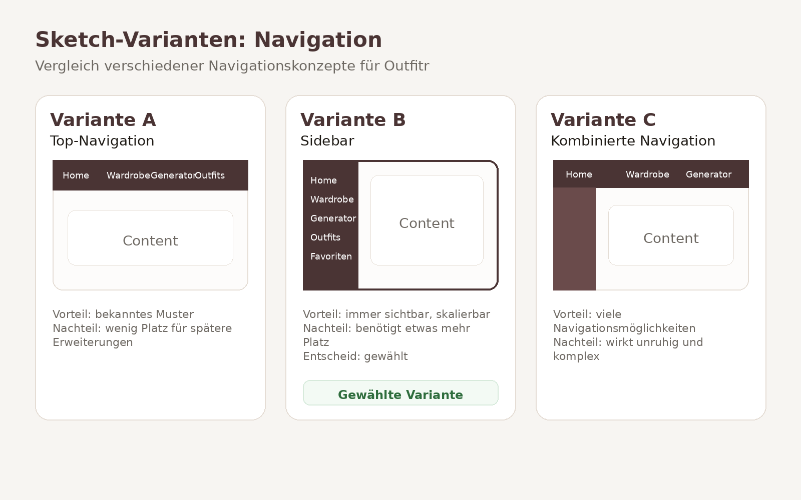
_Vergleich verschiedener Navigationskonzepte für Outfitr_

Für die Navigation wurden drei unterschiedliche Ansätze betrachtet.

**Variante A – Top-Navigation**

- Klassische horizontale Navigation im oberen Seitenbereich
- Bekanntes Bedienkonzept
- Einfache Umsetzung
- Begrenzte Erweiterbarkeit bei zusätzlichen Funktionen

**Variante B – Sidebar-Navigation**

- Vertikale Navigation auf der linken Seite
- Permanente Sichtbarkeit aller Hauptbereiche
- Gute Übersicht bei mehreren Funktionen
- Geeignet für zukünftige Erweiterungen

**Variante C – Kombinierte Navigation**

- Kombination aus Top-Navigation und zusätzlicher Seiten-Navigation
- Hohe Flexibilität
- Viele Navigationsmöglichkeiten
- Gefahr einer überladenen Benutzeroberfläche

---

##### Outfit-Speicherung

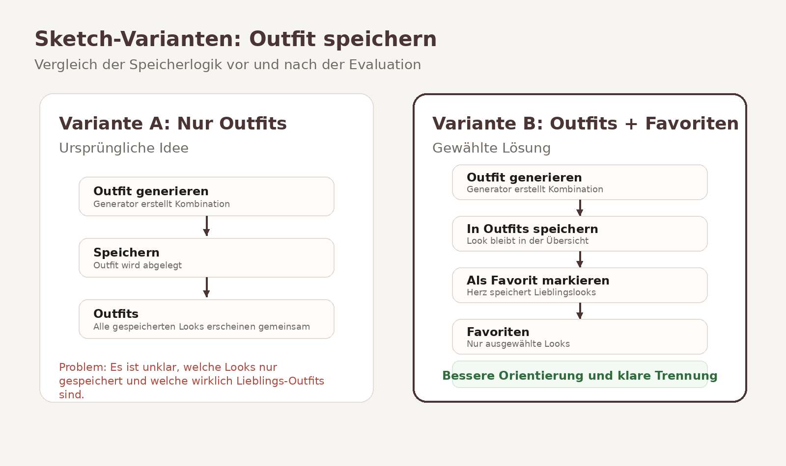
_Vergleich verschiedener Speicherkonzepte_

Für die Verwaltung gespeicherter Outfits wurden zwei Varianten untersucht.

**Variante A – Nur Outfits**

- Generierte Outfits werden direkt gespeichert
- Alle gespeicherten Kombinationen befinden sich in derselben Übersicht
- Einfache Struktur

**Variante B – Outfits und Favoriten**

- Outfits werden zunächst gespeichert
- Besonders gelungene Kombinationen können zusätzlich als Favoriten markiert werden
- Klare Trennung zwischen gespeicherten Outfits und Lieblings-Outfits

---

##### Generator-Layout

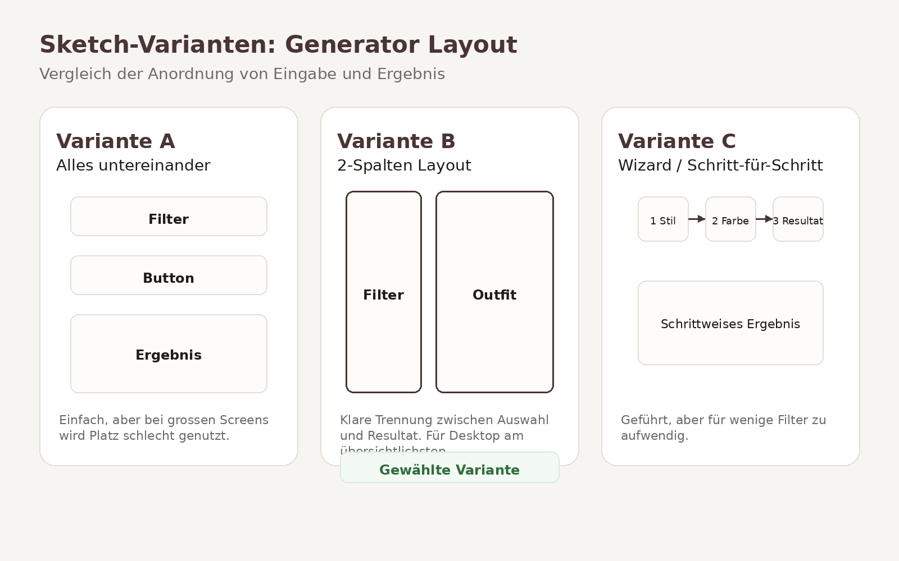

_Vergleich verschiedener Layoutvarianten des Outfit-Generators_

Für die Darstellung des Generators wurden drei unterschiedliche Layouts betrachtet.

**Variante A – Vertikaler Aufbau**

- Filter, Button und Ergebnis untereinander angeordnet
- Einfache Struktur
- Lange Scrollwege auf grösseren Seiten

**Variante B – Zweispaltiges Layout**

- Filter links
- Ergebnis rechts
- Eingabe und Resultat gleichzeitig sichtbar
- Gute Nutzung des verfügbaren Platzes

**Variante C – Schritt-für-Schritt-Prozess**

- Nutzer:innen werden schrittweise durch die Auswahl geführt
- Stärkere Benutzerführung
- Zusätzliche Klicks erforderlich
- Für wenige Filter eher aufwendig

---

### 3.3 Decide

#### Gewählte Variante & Begründung

Nach dem Vergleich der verschiedenen Lösungsansätze wurde eine Sidebar-Navigation als zentrales Navigationskonzept gewählt. Im Gegensatz zu einer klassischen Top-Navigation bleiben alle Hauptfunktionen jederzeit sichtbar und können auch bei zukünftigen Erweiterungen problemlos ergänzt werden.

Für den Outfit-Generator wurde ein zweispaltiges Layout ausgewählt. Die Filter befinden sich auf der linken Seite, während das generierte Outfit rechts angezeigt wird. Dadurch können Eingaben und Ergebnisse gleichzeitig betrachtet werden, ohne dass gescrollt werden muss.

Während der Entwicklung wurde zudem die ursprüngliche Speicherlogik überarbeitet. Anfangs wurden alle generierten Outfits direkt gespeichert. Nach ersten Usability-Überlegungen zeigte sich jedoch, dass Nutzer:innen zwischen gespeicherten Outfits und tatsächlichen Lieblings-Outfits unterscheiden möchten. Deshalb wurde eine zusätzliche Favoritenfunktion eingeführt. Outfits werden nun zunächst gespeichert und können anschliessend separat als Favoriten markiert werden.

Die wichtigsten Entscheidungskriterien waren:

- Übersichtlichkeit der Benutzeroberfläche
- Einfache und intuitive Bedienung
- Skalierbarkeit für zukünftige Erweiterungen
- Klare Trennung von Funktionen
- Konsistenz über alle Seiten hinweg

#### End-to-End-Ablauf

Die folgende User Journey zeigt den vollständigen Hauptworkflow der Anwendung vom ersten Login bis zur Speicherung eines Lieblings-Outfits.

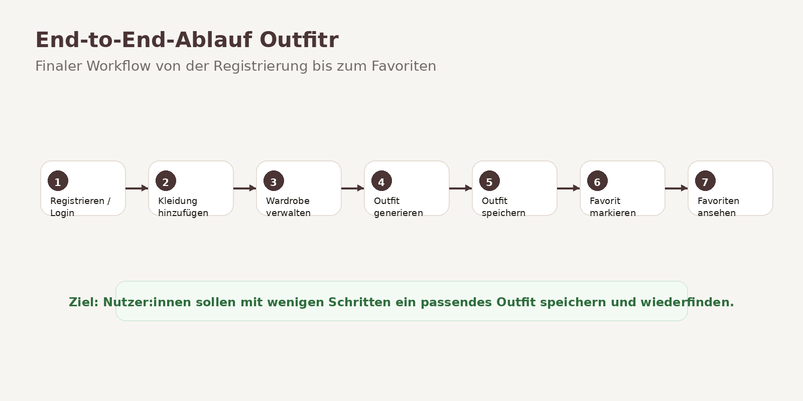

_End-to-End-Ablauf von Outfitr_

Der typische Ablauf eines Nutzers besteht aus folgenden Schritten:

1. Registrierung oder Login
2. Hinzufügen von Kleidungsstücken zum digitalen Kleiderschrank
3. Verwaltung der vorhandenen Kleidung in der Wardrobe
4. Generierung eines passenden Outfits anhand ausgewählter Kriterien
5. Speicherung des generierten Outfits
6. Markierung besonders gelungener Kombinationen als Favorit
7. Verwaltung der Lieblings-Outfits im separaten Favoritenbereich

Das Ziel dieses Ablaufs besteht darin, mit möglichst wenigen Schritten passende Outfit-Kombinationen zu erstellen und dauerhaft verfügbar zu machen.

#### Mockup

Vor der technischen Umsetzung wurde ein interaktives Mockup in Figma erstellt. Dieses diente als Grundlage für die spätere Entwicklung des Prototyps und half dabei, Navigation, Seitenstruktur und Benutzerfluss frühzeitig zu validieren.

**Figma-Prototyp:**

https://www.figma.com/proto/oPUdm8AdTCGR2CFPVoNsk1/Untitled

Folgende Bereiche wurden bereits im Mockup konzipiert:

- Dashboard/Home
- Wardrobe (digitaler Kleiderschrank)
- Outfit Generator
- Gespeicherte Outfits

Anschliessend wurden die einzelnen Ansichten iterativ weiterentwickelt und als funktionaler Prototyp in SvelteKit umgesetzt.

---

### 3.4 Prototype

#### 3.4.1 Entwurf (Design)

#### Informationsarchitektur

Die Anwendung wurde in mehrere Hauptbereiche unterteilt, die den Benutzer durch den gesamten Prozess der Outfit-Erstellung begleiten.

Die primäre Navigation erfolgt über eine dauerhaft sichtbare Sidebar auf der linken Seite. Dadurch können Nutzer:innen jederzeit zwischen den wichtigsten Bereichen der Anwendung wechseln.

Die Sidebar umfasst folgende Bereiche:

- Home / Dashboard
- Wardrobe
- Generator
- Outfits
- Favoriten

Zusätzlich verfügt die Anwendung über ein Profilmenü im oberen rechten Bereich. Dieses dient als sekundäre Navigation für benutzerspezifische Funktionen.

Über das Profilmenü können folgende Funktionen aufgerufen werden:

- Profil
- Dark Mode / Light Mode
- Logout

Durch die Trennung zwischen Hauptnavigation und Profilfunktionen bleibt die Benutzeroberfläche übersichtlich und die wichtigsten Aufgaben stehen jederzeit im Vordergrund.

Die Struktur orientiert sich an den zentralen Nutzungsschritten der Anwendung: Kleidung verwalten, Outfits generieren, Outfits speichern und Favoriten organisieren.

---

#### User Interface Design

Das Design von Outfitr orientiert sich an modernen Fashion- und Lifestyle-Webseiten. Ziel war es, eine minimalistische und hochwertige Benutzeroberfläche zu gestalten, die den Fokus auf die Kleidung und die Outfit-Kombinationen legt.

Besonderer Wert wurde auf Übersichtlichkeit, Wiedererkennbarkeit und eine intuitive Bedienung gelegt. Die Benutzeroberfläche soll auch bei einer grossen Anzahl von Kleidungsstücken einfach verständlich bleiben und Nutzer:innen bei der Zusammenstellung von Outfits unterstützen.

Folgende Gestaltungsprinzipien wurden umgesetzt:

- grosse Kartenlayouts für Kleidungsstücke und Outfits
- klare und gut lesbare Typografie
- dezente Schatten und Rundungen
- reduzierte Farbpalette
- konsistente Buttons und Eingabefelder
- Light Mode und Dark Mode
- einheitliche Icons zur Unterstützung der Navigation

Die wichtigsten Ansichten der Anwendung werden in den folgenden Screenshots dargestellt.

#### Landing Page

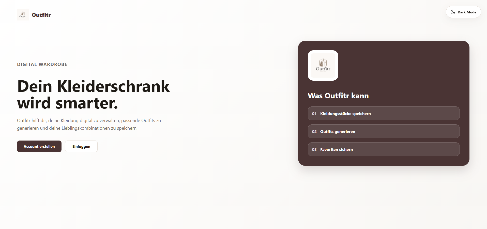

_Abbildung X: Landing Page von Outfitr_

Die Landing Page bildet den Einstiegspunkt der Anwendung. Sie vermittelt den Zweck von Outfitr und erklärt die wichtigsten Funktionen bereits vor der Registrierung. Dadurch erhalten Besucher:innen einen ersten Überblick über den Nutzen der Anwendung und können entscheiden, ob sie einen Account erstellen möchten.

Die Seite enthält eine kurze Einführung in die Kernfunktionen von Outfitr sowie direkte Schaltflächen zur Registrierung und Anmeldung. Zusätzlich kann bereits auf der Landing Page zwischen Light Mode und Dark Mode gewechselt werden.

---

#### Registrierung

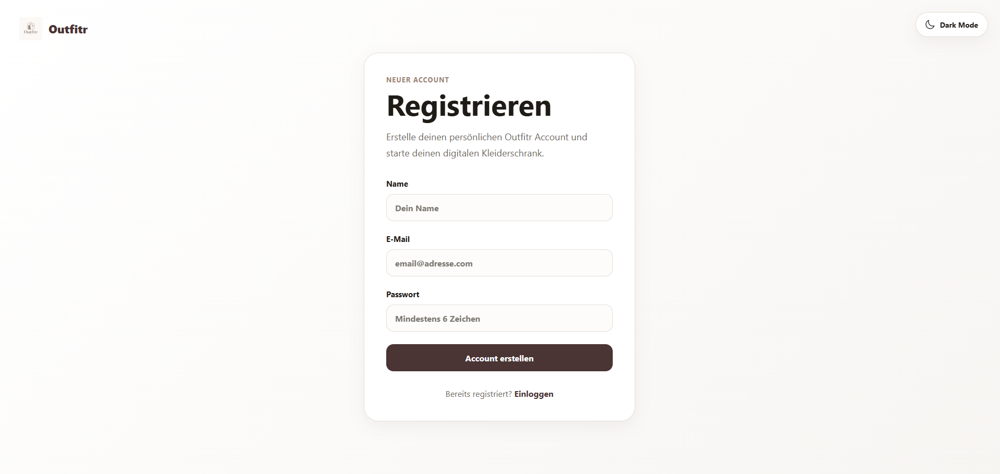

_Abbildung X: Registrierungsformular_

Neue Nutzer:innen können über die Registrierungsseite einen persönlichen Account erstellen. Für die Registrierung werden Name, E-Mail-Adresse und Passwort erfasst.

Die Eingabemaske wurde bewusst einfach gehalten, um den Registrierungsprozess möglichst unkompliziert zu gestalten. Nach erfolgreicher Registrierung erhalten Nutzer:innen Zugriff auf ihren persönlichen digitalen Kleiderschrank.

---

#### Login

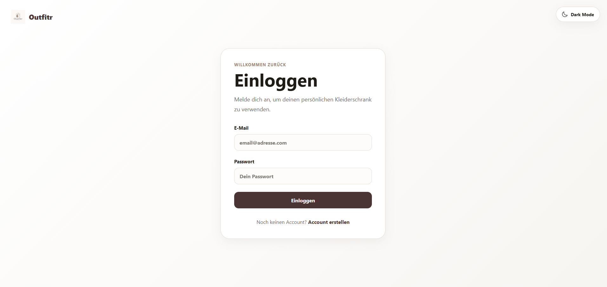

_Abbildung X: Login-Seite_

Bereits registrierte Nutzer:innen können sich über die Login-Seite anmelden. Nach erfolgreicher Authentifizierung gelangen sie direkt in ihre persönliche Anwendung.

Durch die Trennung zwischen öffentlichem Bereich und geschütztem Benutzerbereich bleiben persönliche Kleidungsstücke, Outfits und Favoriten ausschliesslich für den jeweiligen Benutzer sichtbar.

---

#### Dashboard

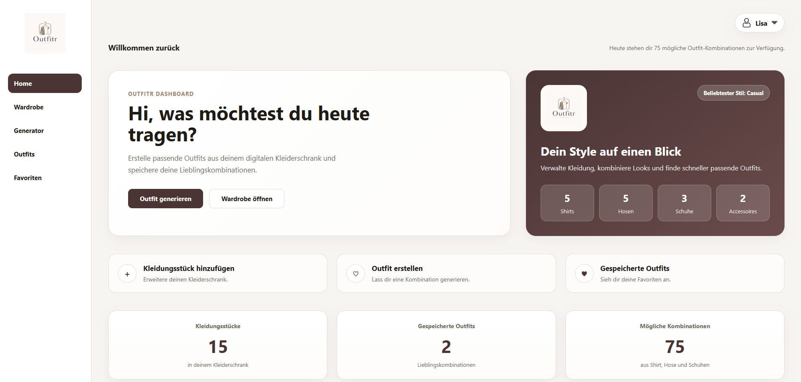

_Abbildung X: Dashboard von Outfitr_

Das Dashboard dient als zentrale Einstiegsseite der Anwendung. Nutzer:innen erhalten einen Überblick über ihren digitalen Kleiderschrank, gespeicherte Outfits sowie mögliche Outfit-Kombinationen. Zusätzlich ermöglichen Schnellzugriffe den direkten Wechsel zu den wichtigsten Funktionen.

---

#### Wardrobe

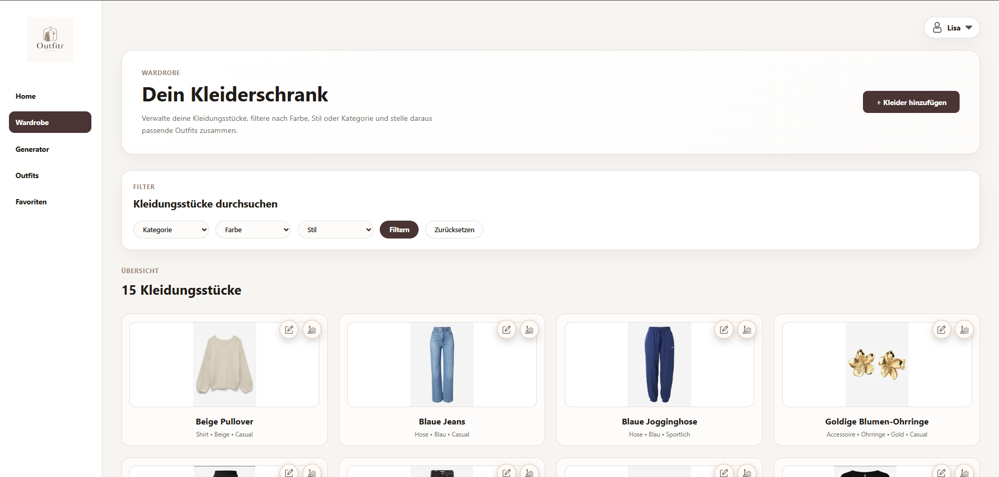

_Abbildung X: Wardrobe-Ansicht mit vorhandenen Kleidungsstücken_

Die Wardrobe bildet den digitalen Kleiderschrank der Anwendung und stellt einen zentralen Bestandteil von Outfitr dar. Alle gespeicherten Kleidungsstücke werden in einer übersichtlichen Kartenansicht dargestellt. Nutzer:innen können ihre Kleidung filtern, bearbeiten oder löschen und behalten dadurch jederzeit den Überblick über ihren Bestand.

Die Karten enthalten die wichtigsten Informationen zu einem Kleidungsstück, wie beispielsweise Kategorie, Farbe, Stil oder Anlass. Durch die visuelle Darstellung mit Bildern wird die Wiedererkennung erleichtert und die Verwaltung des Kleiderschranks intuitiver gestaltet.

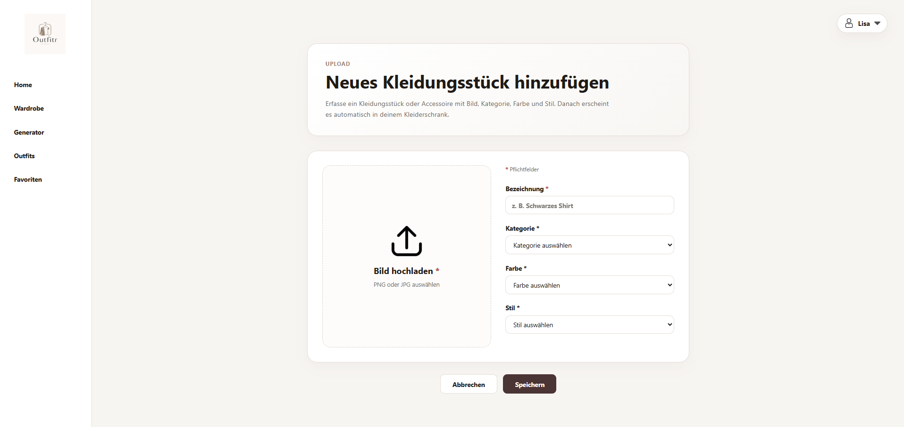

_Abbildung X: Formular zum Hinzufügen eines neuen Kleidungsstücks_

Neue Kleidungsstücke können über die Schaltfläche **„Kleidungsstück hinzufügen“** im oberen Bereich der Seite erfasst werden. Anschliessend öffnet sich ein Formular, über das alle relevanten Informationen hinterlegt werden können.

Dabei können unter anderem folgende Angaben erfasst werden:

- Bild des Kleidungsstücks
- Kategorie
- Farbe
- Stil
- optionale Accessoires

Die gespeicherten Informationen bilden die Grundlage für die spätere Outfit-Generierung. Je vollständiger die hinterlegten Daten sind, desto passender können die vorgeschlagenen Outfit-Kombinationen erstellt werden.

Durch die Kombination aus visueller Darstellung, Filtermöglichkeiten und einfacher Datenerfassung dient die Wardrobe als zentrale Datenbasis der gesamten Anwendung.

---

#### Outfit Generator

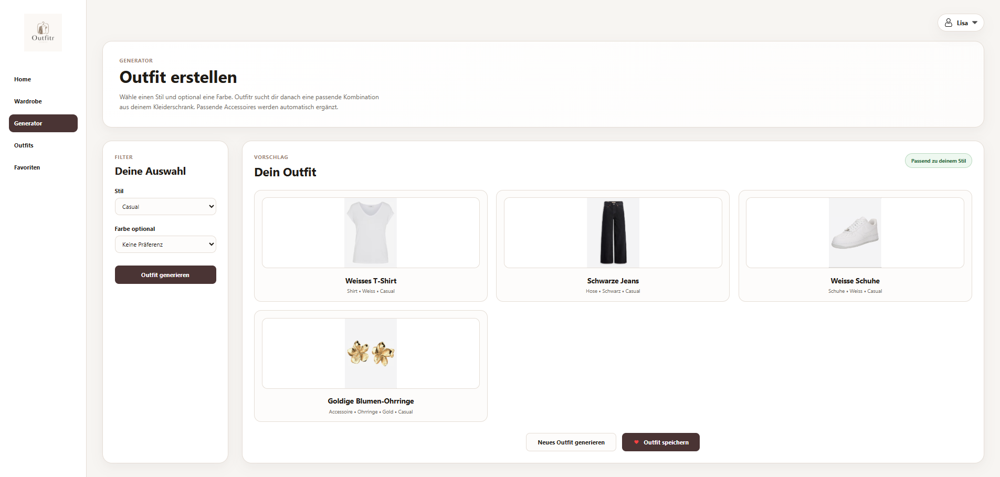

_Abbildung X: Outfit Generator_

Der Outfit Generator stellt die Kernfunktion der Anwendung dar. Nutzer:innen können Stil, Anlass und Farbe auswählen und erhalten auf Basis der vorhandenen Kleidungsstücke automatisch eine passende Outfit-Kombination.

---

#### Gespeicherte Outfits

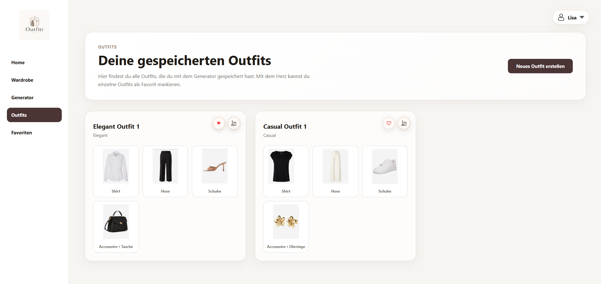

_Abbildung X: Übersicht gespeicherter Outfits_

In diesem Bereich werden alle gespeicherten Outfit-Kombinationen angezeigt. Nutzer:innen können ihre generierten Outfits erneut betrachten, verwalten oder als Favorit markieren.

---

#### Favoriten

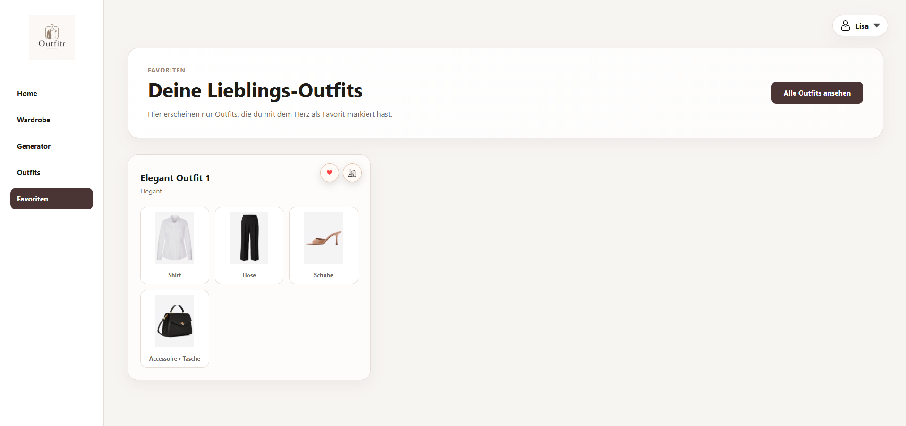

_Abbildung X: Favoritenbereich_

Der Favoritenbereich enthält ausschliesslich die vom Benutzer markierten Lieblings-Outfits. Dadurch entsteht eine klare Trennung zwischen gespeicherten Outfits und besonders bevorzugten Kombinationen.

---

#### Profilmenü

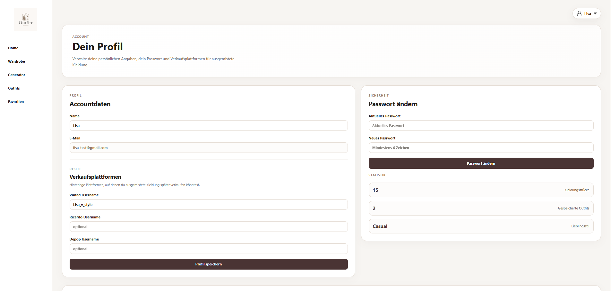

_Abbildung X: Profilmenü und Benutzereinstellungen_

Über das Profilmenü im oberen rechten Bereich können benutzerspezifische Funktionen aufgerufen werden. Dazu gehören die Profilansicht, die Umschaltung zwischen Light Mode und Dark Mode sowie die Abmeldung aus der Anwendung. Das Dropdown-Menü wurde bewusst kompakt gestaltet, damit häufig genutzte Funktionen jederzeit erreichbar bleiben, ohne zusätzlichen Platz in der Hauptnavigation zu beanspruchen.

---

#### Farbkonzept

Die Farbpalette basiert auf neutralen Beige-, Braun- und Off-White-Tönen, um einen modernen und eleganten Fashion-Look zu erzeugen. Für den Light Mode und Dark Mode wurden bewusst ähnliche Farbtöne verwendet, damit die visuelle Identität der Anwendung konsistent bleibt.

#### Light Mode

| Zweck              | HEX     |
| ------------------ | ------- |
| Hintergrund        | #F7F5F2 |
| Primärfarbe        | #4A3434 |
| Sekundärfarbe      | #6A4B4B |
| Akzentfarbe        | #E5DDD5 |
| Zusatzfarbe        | #6F6A64 |
| Dunkle Akzentfarbe | #1F1B16 |

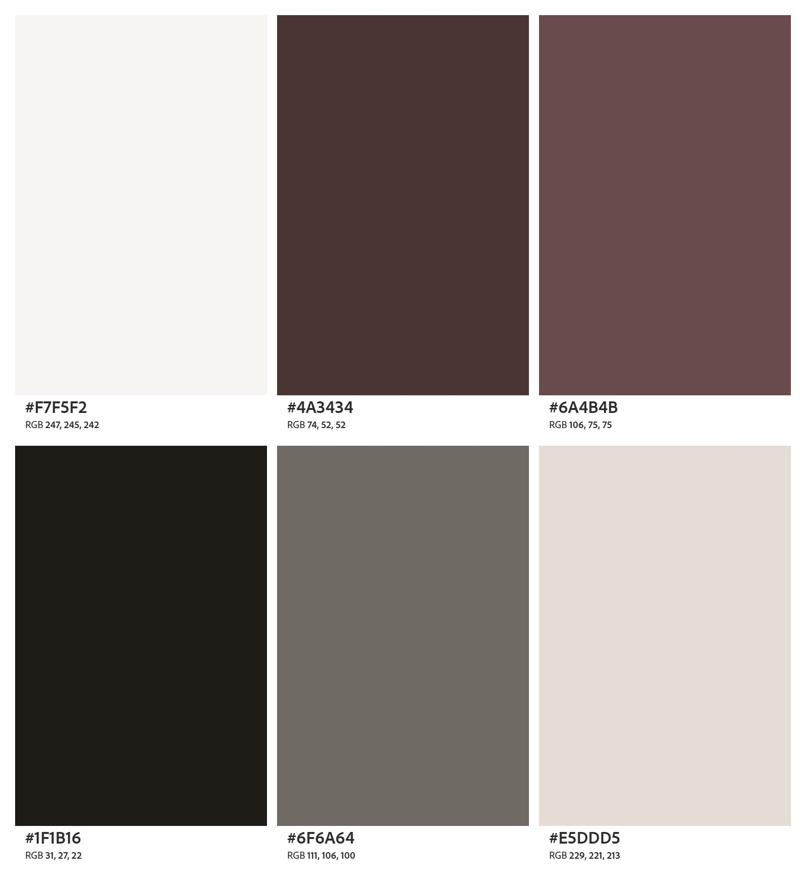

_Abbildung X: Farbpalette des Light Modes_

---

#### Dark Mode

| Zweck             | HEX     |
| ----------------- | ------- |
| Hintergrund       | #111010 |
| Primärfläche      | #1D1717 |
| Sekundärfläche    | #261E1E |
| Primärfarbe       | #4A3838 |
| Akzentfarbe       | #A1866F |
| Helle Akzentfarbe | #D8C7BC |
| Text Hell         | #FFF8F2 |
| Zusatzfarbe       | #E2C3AF |

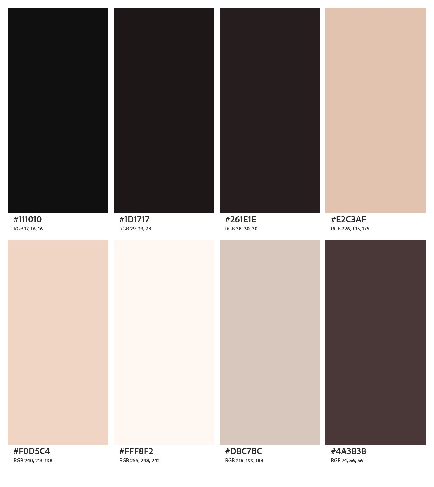

_Abbildung X: Farbpalette des Dark Modes_

---

### Designentscheidungen

Während der Entwicklung wurden mehrere Designentscheidungen getroffen, um die Benutzerfreundlichkeit und Übersichtlichkeit der Anwendung zu erhöhen.

- Sidebar-Navigation statt Top-Navigation für bessere Orientierung und Skalierbarkeit.
- Kartenbasierte Darstellung von Kleidungsstücken und Outfits für eine visuell ansprechende Präsentation.
- Umsetzung eines Light Modes und Dark Modes zur Unterstützung unterschiedlicher Nutzerpräferenzen.
- Verwendung einer reduzierten Farbpalette, um einen modernen Fashion-Look zu erzeugen.
- Einsatz von Icons anstelle von Textsymbolen für eine intuitivere Bedienung.

Nach ersten Überlegungen zur Benutzerführung wurde ausserdem die ursprüngliche Struktur der Outfit-Speicherung angepasst. Anfangs wurden alle generierten Outfits direkt gespeichert und gemeinsam angezeigt. Um die Orientierung zu verbessern, wurde später eine separate Favoritenfunktion eingeführt. Nutzer:innen können Outfits nun speichern und besonders gelungene Kombinationen zusätzlich als Favoriten markieren. Dadurch entsteht eine klarere Trennung zwischen gespeicherten Outfits und tatsächlichen Lieblings-Outfits.

---

#### 3.4.2 Umsetzung (Technik)

### Technologie-Stack

Für die Umsetzung wurden folgende Technologien verwendet:

- SvelteKit
- JavaScript
- HTML / CSS
- Supabase
- Netlify

### Tooling

Verwendete Tools:

- Visual Studio Code
- GitHub
- Netlify
- Figma
- Supabase
- Chrome DevTools

### Struktur & Komponenten

Die Anwendung wurde komponentenbasiert aufgebaut.

Wichtige Seiten und Komponenten:

- Dashboard
- Wardrobe
- Outfit Generator
- Outfit Cards
- Favoriten
- Login / Registrierung
- Sidebar Navigation
- User Dropdown
- Dark Mode Toggle

Die Struktur wurde so gewählt, dass Komponenten mehrfach verwendet werden können.

### Daten & Schnittstellen

Die Daten werden in Supabase gespeichert.

Dabei werden unter anderem gespeichert:

- Benutzerkonten
- Kleidungsstücke
- Outfit-Kombinationen
- Favoriten
- Bildpfade

Bilder werden über Supabase Storage verwaltet.

Die Kommunikation erfolgt über die Supabase-API.

### Deployment

Die Anwendung wurde über Netlify deployed.

Deployment-URL:  
https://outfitr-app.netlify.app/

### Besondere Entscheidungen

Während der Umsetzung wurden mehrere Vereinfachungen vorgenommen:

- Fokus auf Kernfunktionen statt vollständiger Produktumfang
- lokale Zustandsverwaltung statt komplexes State-Management
- einfache Outfitlogik statt KI-basierter Empfehlung
- Accessoires als optionale Ergänzung statt Pflichtbestandteil

Diese Entscheidungen ermöglichten eine stabile und übersichtliche Umsetzung innerhalb des Projektumfangs.

---

### 3.5 Validate

## URL der getesteten Version

https://outfitr-app.netlify.app/

## Ziele der Prüfung

Mit der Evaluation sollten insbesondere folgende Fragen beantwortet werden:

- Ist die Navigation verständlich?
- Können Nutzer:innen intuitiv Outfits generieren?
- Ist die Trennung zwischen Outfits und Favoriten nachvollziehbar?
- Werden wichtige Funktionen schnell gefunden?
- Ist das Design übersichtlich und angenehm?
- Funktioniert der Dark Mode verständlich?

## Vorgehen

Die Tests wurden moderiert durchgeführt.

Die Testpersonen erhielten konkrete Aufgaben und wurden während der Nutzung beobachtet. Zusätzlich wurden Rückfragen gestellt und Beobachtungen dokumentiert.

Die Tests fanden lokal auf einem Notebook statt.

## Stichprobe

Die Tests wurden mit mehreren Personen aus dem privaten Umfeld durchgeführt.

Die Testpersonen waren zwischen 20 und 30 Jahre alt und verfügten über unterschiedliche technische Kenntnisse.

## Aufgaben / Szenarien

Die Testpersonen mussten unter anderem folgende Aufgaben lösen:

1. Registrierung und Login durchführen
2. Neues Kleidungsstück hinzufügen
3. Kleidung filtern
4. Outfit generieren
5. Outfit speichern
6. Outfit als Favorit markieren
7. Favoriten wiederfinden
8. Dark Mode aktivieren

## Kennzahlen & Beobachtungen

Beobachtete Erkenntnisse:

- Navigation wurde schnell verstanden
- Dashboard wurde positiv bewertet
- Die Outfit-Seite war anfangs teilweise verwirrend
- Favoriten wurden zunächst nicht klar erkannt
- Der Dark Mode hatte anfangs Kontrastprobleme
- Die Upload-Funktion wurde als einfach bewertet

## Zusammenfassung der Resultate

Die Evaluation zeigte, dass die grundlegenden Funktionen verständlich und benutzerfreundlich umgesetzt wurden. Besonders positiv bewertet wurden das moderne Design und die einfache Navigation. Gleichzeitig wurde sichtbar, dass die Struktur der Outfitverwaltung verbessert werden musste.

## Abgeleitete Verbesserungen

Folgende Verbesserungen wurden priorisiert:

1. Trennung zwischen Outfits und Favoriten
2. Verbesserung des Dark-Mode-Kontrasts
3. Sichtbarere Icons und Buttons
4. Optimierung der Dropdown-Navigation
5. Verbesserte Rückmeldungen bei Aktionen
6. Ergänzung optionaler Accessoires

## 4. Erweiterungen

### 4.1 Dark Mode

- **Beschreibung & Nutzen:**  
  Für Outfitr wurde zusätzlich zum normalen Light Mode ein vollständiger Dark Mode umgesetzt. Nutzer:innen können zwischen den beiden Modi wechseln. Dadurch wird die Anwendung moderner, angenehmer für die Augen und individueller nutzbar.

- **Wo umgesetzt:**
  - **Frontend:** CSS-Anpassungen für Light- und Dark-Mode in mehreren Seiten und Komponenten
  - **Frontend:** Dark-Mode-Toggle im User-Menü integriert
  - **State Management:** Speicherung des gewählten Themes im Browser mittels Local Storage

- **Referenz:**
  - Beschreibung des Designs in Kapitel 3.4.1
  - Farbpaletten des Light- und Dark-Modes in Kapitel 3.4.1

- **Aus Evaluation abgeleitet?:**  
  Ja. Während der Evaluation wurden Kontrastprobleme und Schwierigkeiten bei der Lesbarkeit im Dark Mode festgestellt und anschliessend verbessert.

---

### 4.2 Favoriten-System

- **Beschreibung & Nutzen:**  
  Die Anwendung wurde um ein separates Favoriten-System erweitert. Nutzer:innen können gespeicherte Outfits zusätzlich als Favoriten markieren. Dadurch werden Lieblings-Outfits klar von normalen gespeicherten Outfits getrennt.

- **Wo umgesetzt:**
  - **Frontend:** Herz-Icon in der Outfit-Verwaltung
  - **Frontend:** Eigene Favoriten-Seite mit separater Darstellung
  - **Datenverwaltung:** Speicherung des Favoriten-Status bei Outfits

- **Referenz:**
  - Beschreibung der Informationsarchitektur in Kapitel 3.4.1
  - Evaluationserkenntnisse in Kapitel 3.5

- **Aus Evaluation abgeleitet?:**  
  Ja. Testpersonen fanden die ursprüngliche Outfit-Seite teilweise verwirrend, weshalb Favoriten separat organisiert wurden.

---

### 4.3 Accessoires als optionale Ergänzung

- **Beschreibung & Nutzen:**  
  Der Outfit-Generator wurde erweitert, sodass zusätzlich optionale Accessoires wie Schmuck, Gürtel oder Sonnenbrillen berücksichtigt werden können. Accessoires sind kein Pflichtbestandteil eines Outfits, können jedoch passende Kombinationen ergänzen.

- **Wo umgesetzt:**
  - **Frontend:** Erweiterung der Kategorien und Darstellung
  - **Logik:** Anpassung der Outfit-Generierung für optionale Accessoires
  - **Datenstruktur:** Speicherung zusätzlicher Kleidungsarten

- **Referenz:**
  - Outfit-Generator in Kapitel 3.4.1
  - Workflow-Beschreibung in Kapitel 3.3

- **Aus Evaluation abgeleitet?:**  
  Teilweise. Die Erweiterung entstand aus dem Wunsch, Outfits realistischer und vollständiger darzustellen.

---

### 4.4 Verbesserte Benutzerführung

- **Beschreibung & Nutzen:**  
  Mehrere kleinere Verbesserungen wurden umgesetzt, um die Benutzerführung verständlicher zu machen. Dazu gehören sichtbare Icons, bessere Kontraste, Dropdown-Verbesserungen und zusätzliche Rückmeldungen bei Aktionen.

- **Wo umgesetzt:**
  - **Frontend:** Optimierung von Buttons, Icons und Dropdown-Menüs
  - **Frontend:** Verbesserte Fehlermeldungen und visuelle Rückmeldungen
  - **Design:** Anpassung der Kontraste im Dark Mode

- **Referenz:**
  - Evaluationsergebnisse in Kapitel 3.5
  - Designentscheidungen in Kapitel 3.4.1

- **Aus Evaluation abgeleitet?:**  
  Ja. Mehrere dieser Anpassungen entstanden direkt aus Beobachtungen während der Tests.

---

### 4.5 Deployment der Anwendung

- **Beschreibung & Nutzen:**  
  Die Anwendung wurde öffentlich über Netlify deployed. Dadurch konnte der Prototyp realistisch getestet und auf verschiedenen Geräten verwendet werden.

- **Wo umgesetzt:**
  - **Deployment:** Netlify
  - **Versionsverwaltung:** GitHub Repository mit automatischem Build-Prozess

- **Referenz:**
  - Deployment-Link in Kapitel 3.4.2
  - Validierung in Kapitel 3.5

- **Aus Evaluation abgeleitet?:**  
  Nein. Das Deployment war notwendig, um die Anwendung online verfügbar zu machen.

## 5. Projektorganisation

### 5.1 Repository & Struktur

Für die Entwicklung wurde GitHub als zentrales Repository verwendet. Der gesamte Quellcode, die Versionsverwaltung sowie das Deployment basieren auf diesem Repository.

GitHub Repository:  
https://github.com/simicjasna/outfitr

Die Projektstruktur wurde modular aufgebaut, damit Komponenten übersichtlich organisiert und wiederverwendet werden können.

### Projektstruktur

```text
outfitr/
│
├── src/
│   ├── lib/                 # Wiederverwendbare Komponenten & Utilities
│   ├── routes/              # Alle Seiten und SvelteKit-Routen
│   ├── app.html             # HTML-Template
│   └── app.css              # Globale Styles
│
├── static/                  # Bilder, Icons und statische Dateien
│
├── supabase/                # Datenbank- und Storage-Konfiguration
│
├── package.json             # Projektabhängigkeiten
├── svelte.config.js         # SvelteKit-Konfiguration
├── vite.config.js           # Vite-Konfiguration
└── README.md                # Projektdokumentation
```

Die Struktur wurde bewusst einfach und übersichtlich gehalten, damit Erweiterungen leichter umgesetzt werden können.

---

### 5.2 Issue-Management

Die Entwicklung erfolgte iterativ und schrittweise. Grössere Aufgaben wurden in kleinere Teilaufgaben aufgeteilt und nacheinander umgesetzt.

Während der Entwicklung wurden insbesondere folgende Bereiche kontinuierlich verbessert:

- Navigation
- Outfit-Logik
- Dark Mode
- Favoriten-System
- Benutzerführung
- Responsive Design
- Upload-Workflow
- Kontrast und Lesbarkeit im Dark Mode

Usability-Probleme aus den Tests wurden dokumentiert und anschliessend priorisiert verbessert.

Zusätzlich wurden Probleme direkt während der Entwicklung getestet und korrigiert, beispielsweise:

- fehlerhafte Navigation
- Probleme beim Bild-Upload
- unübersichtliche Buttons
- fehlende Fehlermeldungen
- unklare Benutzerführung bei Outfits und Favoriten

---

### 5.3 Commit-Praxis

Für die Versionsverwaltung wurde Git verwendet. Änderungen wurden regelmässig mit sprechenden Commit-Nachrichten dokumentiert.

Beispiele für verwendete Commit-Arten:

- `add dark mode`
- `fix upload issue`
- `improve dashboard layout`
- `add favorites page`
- `update outfit generator`
- `improve wardrobe usability`

Durch die regelmässigen Commits konnten Änderungen nachvollziehbar dokumentiert und Fehler einfacher zurückverfolgt werden.

Zusätzlich wurde GitHub mit Netlify verbunden, wodurch neue Versionen der Anwendung direkt deployed werden konnten.

Deployment URL:  
https://outfitr-app.netlify.app/

## 6. KI-Deklaration

### 6.1 KI-Tools

### Eingesetzte Tools

| Tool           | Version / Variante | Zweck                                                                                     |
| -------------- | ------------------ | ----------------------------------------------------------------------------------------- |
| ChatGPT        | GPT-5.5            | Unterstützung bei Dokumentation, CSS, Debugging, Architekturideen und SvelteKit-Problemen |
| GitHub Copilot | –                  | Inline-Codevorschläge und Autovervollständigung im Editor                                 |
| Claude         | Claude Sonnet      | Teilweise Unterstützung bei Formulierungen und Strukturideen                              |

### Zweck & Umfang

Die KI-Tools wurden während des Projekts unterstützend eingesetzt, insbesondere bei technischen Problemen, der Strukturierung der Dokumentation sowie bei UI- und CSS-Anpassungen.

Folgende Bereiche wurden mit KI-Unterstützung umgesetzt:

- Unterstützung bei der Entwicklung mit SvelteKit
- CSS-Optimierungen für Light- und Dark-Mode
- Verbesserung von Kontrast, Responsiveness und Benutzerführung
- Unterstützung bei der Fehleranalyse und beim Debugging
- Vorschläge für Komponentenstruktur und Routing
- Unterstützung bei der Dokumentation und Formulierung einzelner Kapitel
- Unterstützung bei der Vorbereitung der Usability-Evaluation

Teilweise KI-unterstützt entstanden insbesondere:

- Dark-Mode-Implementierung
- Dropdown- und Navigationslogik
- Outfit- und Favoritenstruktur
- Upload- und Formularlogik
- Teile der Dokumentationsstruktur
- CSS-Optimierungen und Layout-Anpassungen

### Eigene Leistung (Abgrenzung)

Die gesamte Projektidee, das Konzept sowie die funktionale Umsetzung wurden eigenständig entwickelt.

Eigenständig erarbeitet wurden insbesondere:

- Die Idee der Anwendung „Outfitr“
- Die Konzeption der Features
- Die gesamte Benutzerführung
- Die Gestaltung des Interface Designs
- Die Farbpalette und Designentscheidungen
- Die Struktur der Anwendung
- Die Datenmodellierung
- Die Auswahl und Integration der Technologien
- Die Umsetzung der Kernfunktionen
- Das Testing und die Evaluation
- Die finale Überarbeitung aller Inhalte

KI-generierte Vorschläge wurden nie ungeprüft übernommen. Sämtliche Vorschläge wurden getestet, angepasst und an die Anforderungen des Projekts angepasst.

---

### 6.2 Prompt-Vorgehen

Der Einsatz von KI erfolgte iterativ und problemorientiert. Typischerweise wurde zuerst das bestehende Problem oder der aktuelle Code beschrieben und anschliessend gezielt nach Lösungsvorschlägen gefragt.

Das Vorgehen bestand meistens aus folgenden Schritten:

1. Beschreibung des Problems oder der gewünschten Funktion
2. Bereitstellen von bestehendem Code oder Screenshots
3. Generierung von Lösungsvorschlägen durch KI
4. Testen der vorgeschlagenen Lösung im Projekt
5. Anpassung und Überarbeitung der Resultate

Beispiele für typische Aufgabenstellungen:

- Verbesserung des Dark Modes
- Debugging von SvelteKit-Fehlern
- Optimierung von CSS und Responsiveness
- Verbesserung der Benutzerführung
- Unterstützung bei der Dokumentationsstruktur
- Formulierung technischer Beschreibungen

Für die Dokumentation wurden zunächst eigene Stichpunkte und Inhalte vorbereitet. Anschliessend wurden diese mit Hilfe von KI sprachlich überarbeitet und strukturiert formuliert.

Bei der Nutzung der KI wurde darauf geachtet, keine urheberrechtlich problematischen Inhalte zu übernehmen. Verwendete Bilder, Icons und Logos stammen aus eigenen oder frei nutzbaren Quellen.

---

### 6.3 Reflexion

Der Einsatz von KI war während des Projekts besonders hilfreich bei technischen Problemen, repetitiven Aufgaben sowie bei der sprachlichen Ausarbeitung der Dokumentation.

### Nutzen

Die KI-Unterstützung ermöglichte insbesondere:

- schnellere Fehlersuche
- effizientere CSS-Anpassungen
- Unterstützung bei komplexeren SvelteKit-Problemen
- schnellere Iterationen im UI-Design
- Unterstützung bei der Strukturierung der Dokumentation

Vor allem bei der Umsetzung des Dark Modes, der Navigation sowie der Responsiveness konnte viel Zeit eingespart werden.

### Grenzen

Trotz der Unterstützung mussten viele Vorschläge angepasst oder korrigiert werden. Teilweise waren generierte Lösungen nicht direkt kompatibel mit der verwendeten SvelteKit- oder Svelte-Version.

Auch Designentscheidungen, Benutzerführung und Architektur konnten nicht vollständig an KI delegiert werden, da hierfür ein eigenes Verständnis des Projekts notwendig war.

### Risiken & Qualitätssicherung

Alle KI-generierten Inhalte wurden manuell überprüft und getestet. Fehlerhafte oder unpassende Vorschläge wurden angepasst oder verworfen.

Besonders bei folgenden Bereichen wurde auf zusätzliche Kontrolle geachtet:

- Formularlogik
- Routing
- Datenverwaltung
- Upload-Funktionalitäten
- Benutzerführung
- Dark-Mode-Kontrast

Die finale Verantwortung für Code, Design und Dokumentation lag jederzeit bei der Projektverfasserin.

## 7. Anhang

### 7.1 Quellen & Abhängigkeiten

| Ressource      | Typ                         | Lizenz                  |
| -------------- | --------------------------- | ----------------------- |
| SvelteKit      | Web Framework               | MIT                     |
| Supabase       | Authentifizierung & Storage | Kommerziell (Free Tier) |
| MongoDB Atlas  | Datenbank                   | Kommerziell (Free Tier) |
| Netlify        | Hosting & Deployment        | Kommerziell (Free Tier) |
| GitHub         | Versionsverwaltung          | Kommerziell (Free Tier) |
| Vite           | Build Tool                  | MIT                     |
| Node.js        | JavaScript Runtime          | MIT                     |
| CSS            | Styling                     | –                       |
| Flaticon       | Icons & UI-Assets           | Flaticon License        |
| ChatGPT        | KI-Unterstützung            | Proprietär              |
| Claude         | KI-Unterstützung            | Proprietär              |
| GitHub Copilot | KI-Unterstützung            | Proprietär              |

---

### 7.2 Verwendete Bilder & Assets

| Ressource               | Verwendung                             | Quelle                    |
| ----------------------- | -------------------------------------- | ------------------------- |
| UI-Icons                | Navigation, Buttons und User Interface | https://www.flaticon.com/ |
| Moodboard & Farbpalette | Dokumentation                          | Eigenständig erstellt     |
| Mockup                  | Figma-Prototyp                         | Eigenständig erstellt     |

---

### 7.3 Testskript & Materialien

Die wichtigsten Testszenarien wurden in Kapitel 3.5 beschrieben.

Getestete Hauptfunktionen:

- Registrierung und Login
- Kleidungsstücke hinzufügen
- Kleidung filtern
- Outfit generieren
- Outfit speichern
- Favoriten markieren
- Navigation zwischen den Seiten
- Dark Mode aktivieren

---

### 7.4 Deployment

| Bereich    | Information                           |
| ---------- | ------------------------------------- |
| Plattform  | Netlify                               |
| Live-URL   | https://outfitr-app.netlify.app/      |
| Repository | https://github.com/simicjasna/outfitr |

---

### 7.5 Lokale Entwicklung

### Dependencies installieren

```bash
npm install
```

### Entwicklungsserver starten

```bash
npm run dev
```

### Produktions-Build erstellen

```bash
npm run build
```

---

### 7.6 Umgebungsvariablen

Die Anwendung verwendet Umgebungsvariablen für die Verbindung mit Supabase und MongoDB.

Beispiel:

```env
PUBLIC_SUPABASE_URL=...
PUBLIC_SUPABASE_ANON_KEY=...
MONGODB_URI=...
```

Die tatsächlichen Zugangsdaten wurden aus Sicherheitsgründen nicht veröffentlicht.
