# Projektdokumentation - Outfitr

## Inhaltsverzeichnis

1. [Ausgangslage](#1-ausgangslage)
2. [Lösungsidee](#2-lösungsidee)
3. [Vorgehen & Artefakte](#3-vorgehen--artefakte)
   - [3.1 Understand & Define](#31-understand--define)
   - [3.2 Sketch](#32-sketch)
   - [3.3 Decide](#33-decide)
   - [3.4 Prototype](#34-prototype)
   - [3.5 Validate](#35-validate)
4. [Erweiterungen](#4-erweiterungen)
5. [Projektorganisation](#5-projektorganisation)
6. [KI-Deklaration](#6-ki-deklaration)
7. [Anhang](#7-anhang)

## 1. Ausgangslage

Im Alltag besitzen viele Menschen eine grosse Anzahl an Kleidungsstücken, haben jedoch trotzdem Schwierigkeiten, schnell passende Outfits zusammenzustellen. Besonders im hektischen Alltag führt dies häufig zu Unsicherheit, Entscheidungsstress und Zeitverlust. Zusätzlich fehlt oft der Überblick über den eigenen Kleiderschrank, wodurch vorhandene Kleidung ineffizient genutzt wird.

Digitale Lösungen im Bereich Kleiderverwaltung fokussieren sich häufig hauptsächlich auf die Organisation von Kleidung, bieten jedoch nur eingeschränkte Unterstützung bei der eigentlichen Outfit-Auswahl. Moderne Anwendungen mit KI-Ansätzen liefern zwar teilweise Outfit-Vorschläge, diese wirken jedoch oft wenig personalisiert oder nicht ausreichend alltagstauglich.

Das Projekt „Outfitr“ verfolgt deshalb das Ziel, eine moderne und benutzerfreundliche Webapplikation zu entwickeln, welche Nutzerinnen und Nutzer bei der Verwaltung ihres digitalen Kleiderschranks sowie bei der schnellen Erstellung passender Outfit-Kombinationen unterstützt.

#### Problem:

Viele Menschen haben Schwierigkeiten, passende Outfits aus ihrer vorhandenen Kleidung zusammenzustellen. Eine grosse Auswahl an Kleidungsstücken führt häufig zu Entscheidungsstress, Unsicherheit und ineffizienter Nutzung der vorhandenen Kleidung. Zusätzlich fehlt oft eine übersichtliche digitale Organisation des eigenen Kleiderschranks.

#### Ziele:

- Digitale Verwaltung des eigenen Kleiderschranks ermöglichen
- Übersicht über vorhandene Kleidung schaffen
- Schnelle Outfit-Kombinationen generieren
- Benutzerfreundliche und moderne Bedienung bieten
- Lieblings-Outfits speichern und organisieren
- Die Outfit-Auswahl im Alltag vereinfachen

#### Primäre Zielgruppe:

Die primäre Zielgruppe besteht aus Studierenden, jungen Erwachsenen sowie berufstätigen Personen mit wenig Zeit, die ihren Kleidungsstil einfacher organisieren und schneller passende Outfit-Kombinationen finden möchten.

#### Weitere Stakeholder:

Weitere Stakeholder sind potenzielle zukünftige Nutzerinnen und Nutzer der Anwendung sowie Personen mit Interesse an digitalen Lifestyle- und Organisationslösungen.

## 2. Lösungsidee

Die Lösungsidee von „Outfitr“ besteht aus einer modernen Webapplikation, welche Nutzerinnen und Nutzer bei der digitalen Organisation ihres Kleiderschranks sowie bei der Erstellung passender Outfit-Kombinationen unterstützt. Ziel ist es, den Prozess der Outfit-Auswahl im Alltag einfacher, schneller und übersichtlicher zu gestalten.

Die Anwendung ermöglicht es, Kleidungsstücke mit Informationen wie Kategorie, Farbe, Stil und Bild zu erfassen und zentral zu verwalten. Basierend auf den gespeicherten Kleidungsstücken können mithilfe eines Outfit-Generators passende Outfit-Kombinationen erstellt werden. Zusätzlich können generierte Outfits gespeichert und als Favoriten markiert werden.

Ein besonderer Fokus lag auf einer einfachen Bedienung, einer übersichtlichen Navigation sowie einem modernen und minimalistischen Design. Die Anwendung wurde bewusst so gestaltet, dass wichtige Funktionen schnell erreichbar sind und Benutzerinnen und Benutzer möglichst wenig Aufwand bei der Verwaltung ihrer Kleidung haben.

#### Kernfunktionalität:

- Registrierung und Login mit Benutzeraccount
- Verwaltung eines digitalen Kleiderschranks
- Hochladen und Bearbeiten von Kleidungsstücken
- Filterung nach Kategorien, Farben und Stilrichtungen
- Outfit-Generator zur Erstellung passender Kombinationen
- Speicherung generierter Outfits
- Favoriten-System für Lieblings-Outfits
- Unterstützung von Accessoires
- Dark Mode für unterschiedliche Nutzungsumgebungen

#### Annahmen:

- Nutzerinnen und Nutzer möchten schneller passende Outfits finden
- Eine digitale Organisation erleichtert den Überblick über vorhandene Kleidung
- Personalisierte Outfit-Vorschläge erhöhen den Nutzen der Anwendung
- Ein modernes und minimalistisches Design verbessert die Benutzererfahrung

#### Abgrenzung:

Die Anwendung stellt keinen vollständigen KI-Stylisten dar und bietet keine professionelle Modeberatung. Ebenfalls nicht Bestandteil des Projekts sind Social-Funktionen, Shopping-Integrationen, mobile Apps oder automatische Bilderkennung von Kleidung.

## 3. Vorgehen & Artefakte

Die Entwicklung von Outfitr erfolgte iterativ anhand der im Unterricht behandelten Design-Thinking-Phasen. Ziel war es, schrittweise einen funktionalen und benutzerfreundlichen Prototypen für die digitale Verwaltung und Kombination von Kleidung zu entwickeln. Die einzelnen Phasen bauten dabei aufeinander auf und wurden mehrfach überarbeitet.

---

### 3.1 Understand & Define

Zu Beginn des Projekts wurde untersucht, welche Herausforderungen Personen bei der Verwaltung ihrer Kleidung und der täglichen Outfitwahl haben. Dabei zeigte sich insbesondere, dass viele Nutzer:innen den Überblick über ihren Kleiderschrank verlieren und vorhandene Kleidungsstücke nicht optimal nutzen.

Häufig werden passende Outfit-Kombinationen spontan zusammengestellt, wodurch viel Zeit verloren geht. Gleichzeitig bleiben bestimmte Kleidungsstücke ungenutzt, da Nutzer:innen vergessen, dass sie diese besitzen oder nicht wissen, wie sie diese kombinieren können.

Im Rahmen der Problemraumanalyse wurden bestehende Lösungen betrachtet und typische Bedürfnisse potenzieller Nutzer:innen analysiert. Dabei zeigte sich, dass viele Anwendungen entweder stark auf Social-Media-Funktionen fokussiert sind oder lediglich eine einfache Verwaltung von Kleidungsstücken ermöglichen. Eine Kombination aus digitalem Kleiderschrank und automatischer Outfit-Generierung wird hingegen nur selten angeboten.

#### Zielgruppenverständnis

Die primäre Zielgruppe besteht aus modeinteressierten Personen zwischen 18 und 35 Jahren, die ihren Kleiderschrank digital organisieren und schneller passende Outfit-Kombinationen finden möchten.

##### Persona 1

**Name:** Lisa, 24 Jahre  
**Beruf:** Studentin und Teilzeitangestellte  
**Technische Erfahrung:** Hoch

**Ziele:**

- Überblick über ihre Kleidung behalten
- Zeit bei der Outfit-Auswahl sparen
- Neue Outfit-Kombinationen entdecken
- Lieblings-Outfits speichern

**Probleme:**

- Viele Kleidungsstücke werden selten getragen
- Passende Kombinationen sind nicht immer offensichtlich
- Der Kleiderschrank wirkt unübersichtlich
- Outfits werden häufig spontan zusammengestellt

**Bedürfnisse:**

- Digitale Verwaltung ihrer Kleidung
- Automatische Outfit-Vorschläge
- Einfache Bedienung
- Moderne und übersichtliche Benutzeroberfläche

##### Persona 2

**Name:** Marco, 29 Jahre  
**Beruf:** Marketing Manager  
**Technische Erfahrung:** Mittel

**Ziele:**

- Morgens schneller passende Outfits finden
- Kleidung strukturierter organisieren
- Doppelte Käufe vermeiden
- Lieblingskombinationen wiederverwenden

**Probleme:**

- Wenig Zeit für die Outfit-Auswahl
- Überblick über vorhandene Kleidung fehlt
- Vergisst selten getragene Kleidungsstücke
- Schwierigkeiten bei der Kombination verschiedener Kleidungsstücke

**Bedürfnisse:**

- Schnelle Outfit-Empfehlungen
- Übersicht über vorhandene Kleidung
- Speicherung von Favoriten
- Einfache Navigation ohne lange Einarbeitung

#### Wesentliche Erkenntnisse

- Nutzer:innen wünschen eine einfache und übersichtliche Bedienung.
- Die Outfit-Erstellung soll schnell und intuitiv funktionieren.
- Viele Personen verlieren den Überblick über ihre vorhandene Kleidung.
- Selten getragene Kleidungsstücke geraten häufig in Vergessenheit.
- Die Verwaltung von Kleidung muss visuell verständlich sein.
- Favoriten und gespeicherte Outfits sollen getrennt organisiert werden.
- Automatische Outfit-Vorschläge bieten einen zusätzlichen Mehrwert.
- Ein modernes und minimalistisches Design erhöht die Benutzerfreundlichkeit.
- Personalisierte Benutzerkonten ermöglichen eine individuelle Nutzung der Anwendung.

---

### 3.2 Sketch

#### Variantenüberblick

In der Sketch-Phase wurden verschiedene Lösungsansätze für die Navigation, die Outfit-Speicherung und den Outfit-Generator entwickelt. Ziel war es, unterschiedliche Möglichkeiten zu vergleichen und deren Vor- und Nachteile sichtbar zu machen, bevor eine konkrete Lösung ausgewählt wurde.

#### Skizzen

##### Navigation


_Abbildung 1: Vergleich verschiedener Navigationskonzepte für Outfitr_

Für die Navigation wurden drei unterschiedliche Ansätze betrachtet.

**Variante A – Top-Navigation**

- Klassische horizontale Navigation im oberen Seitenbereich
- Bekanntes Bedienkonzept
- Einfache Umsetzung
- Begrenzte Erweiterbarkeit bei zusätzlichen Funktionen

**Variante B – Sidebar-Navigation**

- Vertikale Navigation auf der linken Seite
- Permanente Sichtbarkeit aller Hauptbereiche
- Gute Übersicht bei mehreren Funktionen
- Geeignet für zukünftige Erweiterungen

**Variante C – Kombinierte Navigation**

- Kombination aus Top-Navigation und zusätzlicher Seiten-Navigation
- Hohe Flexibilität
- Viele Navigationsmöglichkeiten
- Gefahr einer überladenen Benutzeroberfläche

---

##### Outfit-Speicherung


_Abbildung 2: Vergleich verschiedener Speicherkonzepte_

Für die Verwaltung gespeicherter Outfits wurden zwei Varianten untersucht.

**Variante A – Nur Outfits**

- Generierte Outfits werden direkt gespeichert
- Alle gespeicherten Kombinationen befinden sich in derselben Übersicht
- Einfache Struktur

**Variante B – Outfits und Favoriten**

- Outfits werden zunächst gespeichert
- Besonders gelungene Kombinationen können zusätzlich als Favoriten markiert werden
- Klare Trennung zwischen gespeicherten Outfits und Lieblings-Outfits

---

##### Generator-Layout


_Abbildung 3: Vergleich verschiedener Layoutvarianten des Outfit-Generators_

Für die Darstellung des Generators wurden drei unterschiedliche Layouts betrachtet.

**Variante A – Vertikaler Aufbau**

- Filter, Button und Ergebnis untereinander angeordnet
- Einfache Struktur
- Lange Scrollwege auf grösseren Seiten

**Variante B – Zweispaltiges Layout**

- Filter links
- Ergebnis rechts
- Eingabe und Resultat gleichzeitig sichtbar
- Gute Nutzung des verfügbaren Platzes

**Variante C – Schritt-für-Schritt-Prozess**

- Nutzer:innen werden schrittweise durch die Auswahl geführt
- Stärkere Benutzerführung
- Zusätzliche Klicks erforderlich
- Für wenige Filter eher aufwendig

---

### 3.3 Decide

#### Gewählte Variante & Begründung

Nach dem Vergleich der verschiedenen Lösungsansätze wurde eine Sidebar-Navigation als zentrales Navigationskonzept gewählt. Im Gegensatz zu einer klassischen Top-Navigation bleiben alle Hauptfunktionen jederzeit sichtbar und können auch bei zukünftigen Erweiterungen problemlos ergänzt werden.

Für den Outfit-Generator wurde ein zweispaltiges Layout ausgewählt. Die Filter befinden sich auf der linken Seite, während das generierte Outfit rechts angezeigt wird. Dadurch können Eingaben und Ergebnisse gleichzeitig betrachtet werden, ohne dass gescrollt werden muss.

Während der Entwicklung wurde zudem die ursprüngliche Speicherlogik überarbeitet. Anfangs wurden alle generierten Outfits direkt gespeichert. Nach ersten Usability-Überlegungen zeigte sich jedoch, dass Nutzer:innen zwischen gespeicherten Outfits und tatsächlichen Lieblings-Outfits unterscheiden möchten. Deshalb wurde eine zusätzliche Favoritenfunktion eingeführt. Outfits werden nun zunächst gespeichert und können anschliessend separat als Favoriten markiert werden.

Die wichtigsten Entscheidungskriterien waren:

- Übersichtlichkeit der Benutzeroberfläche
- Einfache und intuitive Bedienung
- Skalierbarkeit für zukünftige Erweiterungen
- Klare Trennung von Funktionen
- Konsistenz über alle Seiten hinweg

#### End-to-End-Ablauf

Die folgende User Journey zeigt den vollständigen Hauptworkflow der Anwendung vom ersten Login bis zur Speicherung eines Lieblings-Outfits.


_Abbildung 4: End-to-End-Ablauf von Outfitr_

Der typische Ablauf eines Nutzers besteht aus folgenden Schritten:

1. Registrierung oder Login
2. Hinzufügen von Kleidungsstücken zum digitalen Kleiderschrank
3. Verwaltung der vorhandenen Kleidung in der Wardrobe
4. Generierung eines passenden Outfits anhand ausgewählter Kriterien
5. Speicherung des generierten Outfits
6. Markierung besonders gelungener Kombinationen als Favorit
7. Verwaltung der Lieblings-Outfits im separaten Favoritenbereich

Das Ziel dieses Ablaufs besteht darin, mit möglichst wenigen Schritten passende Outfit-Kombinationen zu erstellen und dauerhaft verfügbar zu machen.

#### User Journey Map

Die folgende Tabelle fasst die wichtigsten Aktivitäten eines Nutzers entlang der zentralen User Journey zusammen.

| Phase                      | Aktion des Nutzers                           | Ziel                                        |
| -------------------------- | -------------------------------------------- | ------------------------------------------- |
| Einstieg                   | Registrierung oder Login                     | Zugriff auf persönliche Daten               |
| Aufbau des Kleiderschranks | Kleidungsstücke hochladen und kategorisieren | Digitale Wardrobe erstellen                 |
| Verwaltung                 | Kleidung filtern und verwalten               | Überblick über vorhandene Kleidung behalten |
| Outfit-Erstellung          | Outfit generieren                            | Neue Kombinationen entdecken                |
| Speicherung                | Outfit speichern                             | Kombination dauerhaft sichern               |
| Favorisierung              | Outfit als Favorit markieren                 | Lieblings-Outfits hervorheben               |
| Nutzung                    | Favoriten erneut aufrufen                    | Schneller Zugriff auf bevorzugte Outfits    |

Die User Journey verdeutlicht, dass sich der gesamte Workflow auf eine möglichst einfache Verwaltung des Kleiderschranks und die schnelle Erstellung passender Outfit-Kombinationen konzentriert.

#### Mockup

Vor der technischen Umsetzung wurde ein interaktives Mockup in Figma erstellt. Dieses diente als Grundlage für die spätere Entwicklung des Prototyps und half dabei, Navigation, Seitenstruktur und Benutzerfluss frühzeitig zu validieren.

**Figma-Prototyp:**

https://www.figma.com/proto/oPUdm8AdTCGR2CFPVoNsk1/Untitled

Folgende Bereiche wurden bereits im Mockup konzipiert:

- Dashboard/Home
- Wardrobe (digitaler Kleiderschrank)
- Upload der Kleider
- Outfit Generator
- Gespeicherte Outfits

Anschliessend wurden die einzelnen Ansichten iterativ weiterentwickelt und als funktionaler Prototyp in SvelteKit umgesetzt.

##### Dashboard

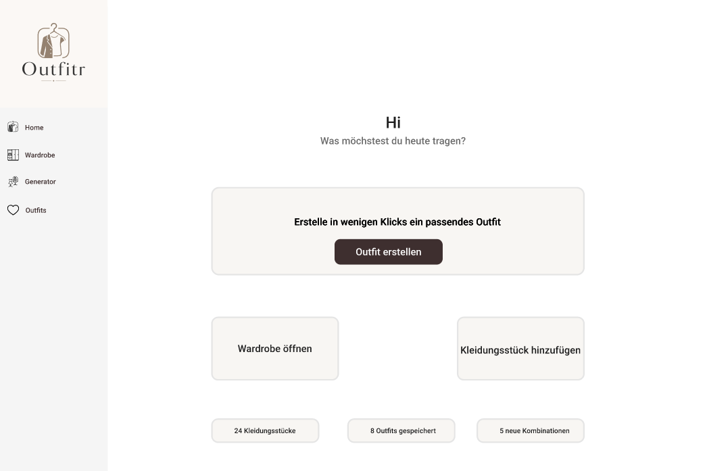

_Abbildung 5: Dashboard-Ansicht des Figma-Mockups. Die Seite dient als zentrale Startseite der Anwendung und bietet Zugriff auf die wichtigsten Funktionen._

##### Wardrobe

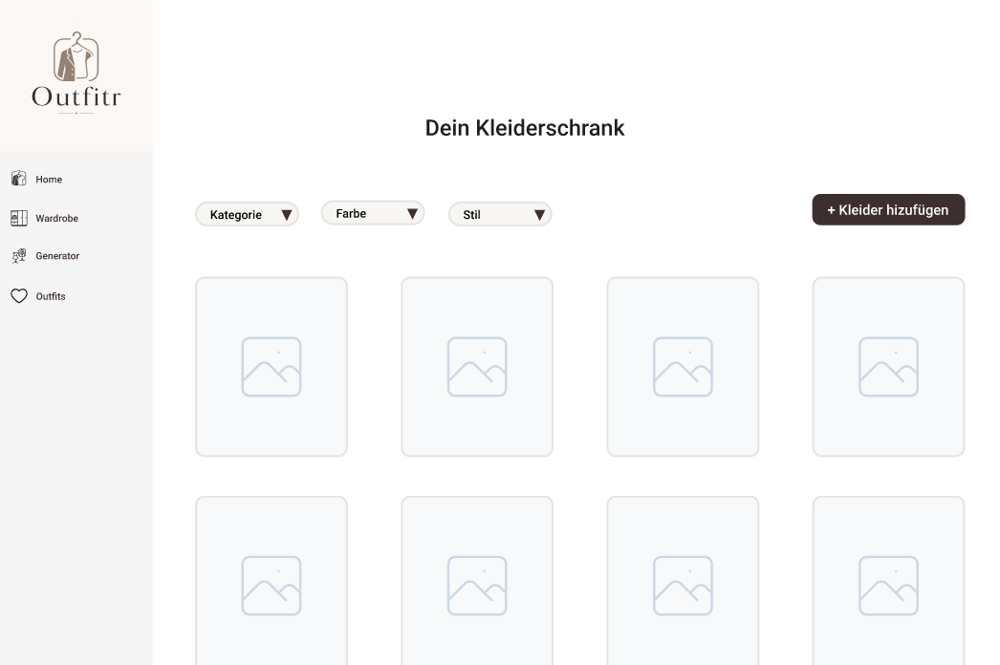

_Abbildung 6: Mockup des digitalen Kleiderschranks. Nutzer:innen können ihre Kleidungsstücke verwalten und filtern._

##### Upload

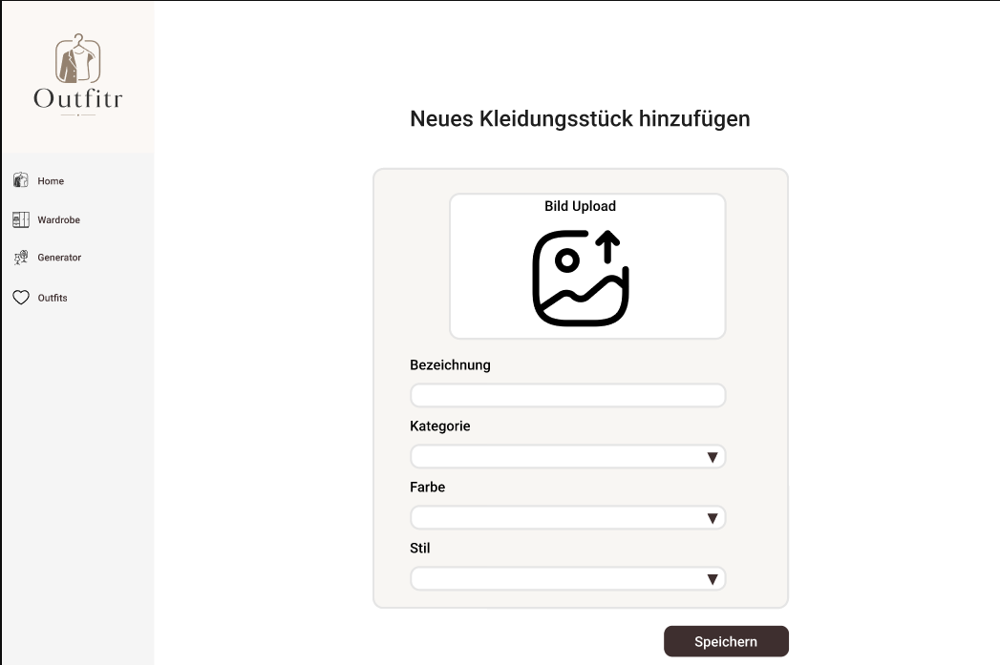

_Abbildung 7: Mockup der Upload-Seite. Nutzer:innen können neue Kleidungsstücke inklusive Bild, Kategorie, Farbe und Stil erfassen und ihrem digitalen Kleiderschrank hinzufügen._

##### Outfit Generator

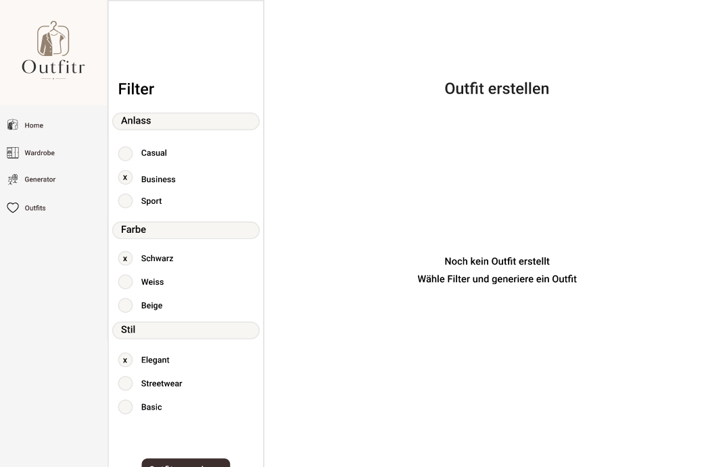

_Abbildung 8: Entwurf des Outfit-Generators mit Filterbereich und Vorschau der generierten Outfit-Kombination._

##### Gespeicherte Outfits

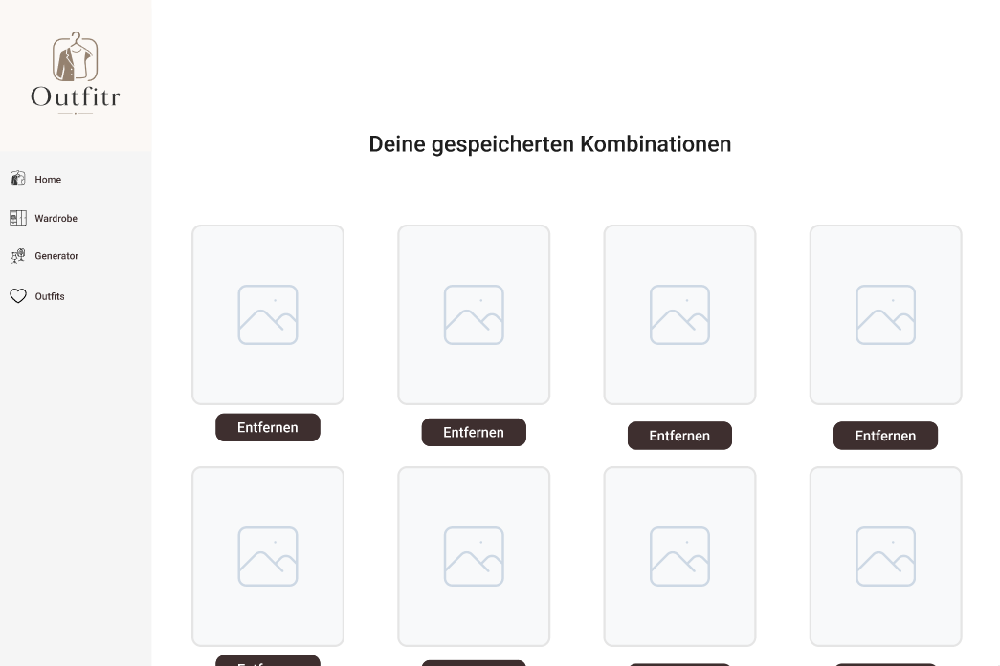

_Abbildung 9: Mockup der Outfit-Verwaltung zur Speicherung und Organisation bereits erstellter Outfits._

---

### 3.4 Prototype

#### 3.4.1 Entwurf (Design)

#### Informationsarchitektur

Die Anwendung wurde in mehrere Hauptbereiche unterteilt, die den Benutzer durch den gesamten Prozess der Outfit-Erstellung begleiten.

Die primäre Navigation erfolgt über eine dauerhaft sichtbare Sidebar auf der linken Seite. Dadurch können Nutzer:innen jederzeit zwischen den wichtigsten Bereichen der Anwendung wechseln.

Die Sidebar umfasst folgende Bereiche:

- Home / Dashboard
- Wardrobe
- Generator
- Outfits
- Favoriten

Zusätzlich verfügt die Anwendung über ein Profilmenü im oberen rechten Bereich. Dieses dient als sekundäre Navigation für benutzerspezifische Funktionen.

Über das Profilmenü können folgende Funktionen aufgerufen werden:

- Profil
- Dark Mode / Light Mode
- Logout

Durch die Trennung zwischen Hauptnavigation und Profilfunktionen bleibt die Benutzeroberfläche übersichtlich und die wichtigsten Aufgaben stehen jederzeit im Vordergrund.

Die Struktur orientiert sich an den zentralen Nutzungsschritten der Anwendung: Kleidung verwalten, Outfits generieren, Outfits speichern und Favoriten organisieren.

---

#### User Interface Design

Das Design von Outfitr orientiert sich an modernen Fashion- und Lifestyle-Webseiten. Ziel war es, eine minimalistische und hochwertige Benutzeroberfläche zu gestalten, die den Fokus auf die Kleidung und die Outfit-Kombinationen legt.

Besonderer Wert wurde auf Übersichtlichkeit, Wiedererkennbarkeit und eine intuitive Bedienung gelegt. Die Benutzeroberfläche soll auch bei einer grossen Anzahl von Kleidungsstücken einfach verständlich bleiben und Nutzer:innen bei der Zusammenstellung von Outfits unterstützen.

Folgende Gestaltungsprinzipien wurden umgesetzt:

- grosse Kartenlayouts für Kleidungsstücke und Outfits
- klare und gut lesbare Typografie
- dezente Schatten und Rundungen
- reduzierte Farbpalette
- konsistente Buttons und Eingabefelder
- Light Mode und Dark Mode
- einheitliche Icons zur Unterstützung der Navigation

Die wichtigsten Ansichten der Anwendung werden in den folgenden Screenshots dargestellt.

#### Landing Page


_Abbildung 10: Landing Page von Outfitr_

Die Landing Page bildet den Einstiegspunkt der Anwendung. Sie vermittelt den Zweck von Outfitr und erklärt die wichtigsten Funktionen bereits vor der Registrierung. Dadurch erhalten Besucher:innen einen ersten Überblick über den Nutzen der Anwendung und können entscheiden, ob sie einen Account erstellen möchten.

Die Seite enthält eine kurze Einführung in die Kernfunktionen von Outfitr sowie direkte Schaltflächen zur Registrierung und Anmeldung. Zusätzlich kann bereits auf der Landing Page zwischen Light Mode und Dark Mode gewechselt werden.

---

#### Registrierung


_Abbildung 11: Registrierungsformular_

Neue Nutzer:innen können über die Registrierungsseite einen persönlichen Account erstellen. Für die Registrierung werden Name, E-Mail-Adresse und Passwort erfasst.

Die Eingabemaske wurde bewusst einfach gehalten, um den Registrierungsprozess möglichst unkompliziert zu gestalten. Nach erfolgreicher Registrierung erhalten Nutzer:innen Zugriff auf ihren persönlichen digitalen Kleiderschrank.

---

#### Login


_Abbildung 12: Login-Seite_

Bereits registrierte Nutzer:innen können sich über die Login-Seite anmelden. Nach erfolgreicher Authentifizierung gelangen sie direkt in ihre persönliche Anwendung.

Durch die Trennung zwischen öffentlichem Bereich und geschütztem Benutzerbereich bleiben persönliche Kleidungsstücke, Outfits und Favoriten ausschliesslich für den jeweiligen Benutzer sichtbar.

---

#### Dashboard


_Abbildung 13: Dashboard von Outfitr_

Das Dashboard dient als zentrale Einstiegsseite der Anwendung. Nutzer:innen erhalten einen Überblick über ihren digitalen Kleiderschrank, gespeicherte Outfits sowie mögliche Outfit-Kombinationen. Zusätzlich ermöglichen Schnellzugriffe den direkten Wechsel zu den wichtigsten Funktionen.

---

#### Wardrobe


_Abbildung 14: Wardrobe-Ansicht mit vorhandenen Kleidungsstücken_

Die Wardrobe bildet den digitalen Kleiderschrank der Anwendung und stellt einen zentralen Bestandteil von Outfitr dar. Alle gespeicherten Kleidungsstücke werden in einer übersichtlichen Kartenansicht dargestellt. Nutzer:innen können ihre Kleidung filtern, bearbeiten oder löschen und behalten dadurch jederzeit den Überblick über ihren Bestand.

Die Karten enthalten die wichtigsten Informationen zu einem Kleidungsstück, wie beispielsweise Kategorie, Farbe, Stil oder Anlass. Durch die visuelle Darstellung mit Bildern wird die Wiedererkennung erleichtert und die Verwaltung des Kleiderschranks intuitiver gestaltet.


_Abbildung 15: Formular zum Hinzufügen eines neuen Kleidungsstücks_

Neue Kleidungsstücke können über die Schaltfläche **„Kleidungsstück hinzufügen“** im oberen Bereich der Seite erfasst werden. Anschliessend öffnet sich ein Formular, über das alle relevanten Informationen hinterlegt werden können.

Dabei können unter anderem folgende Angaben erfasst werden:

- Bild des Kleidungsstücks
- Kategorie
- Farbe
- Stil
- optionale Accessoires

Die gespeicherten Informationen bilden die Grundlage für die spätere Outfit-Generierung. Je vollständiger die hinterlegten Daten sind, desto passender können die vorgeschlagenen Outfit-Kombinationen erstellt werden.

Durch die Kombination aus visueller Darstellung, Filtermöglichkeiten und einfacher Datenerfassung dient die Wardrobe als zentrale Datenbasis der gesamten Anwendung.

---

#### Outfit Generator


_Abbildung 16: Outfit Generator_

Der Outfit Generator stellt die Kernfunktion der Anwendung dar. Nutzer:innen können Stil, Anlass und Farbe auswählen und erhalten auf Basis der vorhandenen Kleidungsstücke automatisch eine passende Outfit-Kombination.

---

#### Gespeicherte Outfits


_Abbildung 17: Übersicht gespeicherter Outfits_

In diesem Bereich werden alle gespeicherten Outfit-Kombinationen angezeigt. Nutzer:innen können ihre generierten Outfits erneut betrachten, verwalten oder als Favorit markieren.

---

#### Favoriten


_Abbildung 18: Favoritenbereich_

Der Favoritenbereich enthält ausschliesslich die vom Benutzer markierten Lieblings-Outfits. Dadurch entsteht eine klare Trennung zwischen gespeicherten Outfits und besonders bevorzugten Kombinationen.

---

#### Profilmenü


_Abbildung 19: Profilmenü und Benutzereinstellungen_

Über das Profilmenü im oberen rechten Bereich können benutzerspezifische Funktionen aufgerufen werden. Dazu gehören die Profilansicht, die Umschaltung zwischen Light Mode und Dark Mode sowie die Abmeldung aus der Anwendung. Das Dropdown-Menü wurde bewusst kompakt gestaltet, damit häufig genutzte Funktionen jederzeit erreichbar bleiben, ohne zusätzlichen Platz in der Hauptnavigation zu beanspruchen.

---

#### Farbkonzept

Die Farbpalette basiert auf neutralen Beige-, Braun- und Off-White-Tönen, um einen modernen und eleganten Fashion-Look zu erzeugen. Für den Light Mode und Dark Mode wurden bewusst ähnliche Farbtöne verwendet, damit die visuelle Identität der Anwendung konsistent bleibt.

#### Light Mode

| Zweck              | HEX     |
| ------------------ | ------- |
| Hintergrund        | #F7F5F2 |
| Primärfarbe        | #4A3434 |
| Sekundärfarbe      | #6A4B4B |
| Akzentfarbe        | #E5DDD5 |
| Zusatzfarbe        | #6F6A64 |
| Dunkle Akzentfarbe | #1F1B16 |


_Abbildung 20: Farbpalette des Light Modes_

---

#### Dark Mode

| Zweck             | HEX     |
| ----------------- | ------- |
| Hintergrund       | #111010 |
| Primärfläche      | #1D1717 |
| Sekundärfläche    | #261E1E |
| Primärfarbe       | #4A3838 |
| Akzentfarbe       | #A1866F |
| Helle Akzentfarbe | #D8C7BC |
| Text Hell         | #FFF8F2 |
| Zusatzfarbe       | #E2C3AF |


_Abbildung 21: Farbpalette des Dark Modes_

---

### Designentscheidungen

Während der Entwicklung wurden mehrere Designentscheidungen getroffen, um die Benutzerfreundlichkeit und Übersichtlichkeit der Anwendung zu erhöhen.

- Sidebar-Navigation statt Top-Navigation für bessere Orientierung und Skalierbarkeit.
- Kartenbasierte Darstellung von Kleidungsstücken und Outfits für eine visuell ansprechende Präsentation.
- Umsetzung eines Light Modes und Dark Modes zur Unterstützung unterschiedlicher Nutzerpräferenzen.
- Verwendung einer reduzierten Farbpalette, um einen modernen Fashion-Look zu erzeugen.
- Einsatz von Icons anstelle von Textsymbolen für eine intuitivere Bedienung.

Nach ersten Überlegungen zur Benutzerführung wurde ausserdem die ursprüngliche Struktur der Outfit-Speicherung angepasst. Anfangs wurden alle generierten Outfits direkt gespeichert und gemeinsam angezeigt. Um die Orientierung zu verbessern, wurde später eine separate Favoritenfunktion eingeführt. Nutzer:innen können Outfits nun speichern und besonders gelungene Kombinationen zusätzlich als Favoriten markieren. Dadurch entsteht eine klarere Trennung zwischen gespeicherten Outfits und tatsächlichen Lieblings-Outfits.

---

#### 3.4.2 Umsetzung (Technik)

### Technologie-Stack

Für die Umsetzung von Outfitr wurden moderne Webtechnologien verwendet. Ziel war die Entwicklung einer vollständig webbasierten Anwendung, die auf unterschiedlichen Geräten genutzt werden kann.

Verwendete Technologien:

- SvelteKit als Frontend- und Applikationsframework
- JavaScript für die Anwendungslogik
- HTML und CSS für die Benutzeroberfläche
- MongoDB Atlas als Cloud-Datenbank
- MongoDB Node.js Driver für den Datenzugriff
- Netlify für Hosting und Deployment
- GitHub für Versionsverwaltung und Quellcodeverwaltung

---

### Tooling

Während der Entwicklung kamen verschiedene Werkzeuge zum Einsatz.

Verwendete Tools:

- Visual Studio Code
- GitHub
- Figma
- MongoDB Compass
- MongoDB Atlas
- Netlify
- Chrome DevTools

MongoDB Compass wurde für die Verwaltung und Analyse der Datenbankinhalte verwendet. Über MongoDB Atlas wurde die Datenbank in der Cloud bereitgestellt und mit der Anwendung verbunden.

---

### Struktur & Komponenten

Die Anwendung wurde komponentenbasiert aufgebaut, um eine gute Wiederverwendbarkeit und Wartbarkeit sicherzustellen.

Wichtige Seiten:

- Landing Page
- Registrierung
- Login
- Dashboard
- Wardrobe
- Generator
- Outfits
- Favoriten

Wichtige Komponenten:

- Sidebar Navigation
- User Dropdown
- Dark Mode Toggle
- Outfit Cards
- Clothing Cards
- Upload Formulare
- Filter-Komponenten

Die Navigation zwischen den einzelnen Bereichen erfolgt über das Routing-System von SvelteKit.

---

### Daten & Schnittstellen

Für die Speicherung der Anwendungsdaten wird MongoDB Atlas verwendet. Die Verbindung zur Datenbank erfolgt über eine geschützte Datenbank-URI, welche über Umgebungsvariablen konfiguriert wird.

Die Anwendung verwendet die Datenbank **outfitr** mit vier zentralen Collections.

#### Datenbankstruktur

```text
outfitr
├── users
├── sessions
├── clothes
└── outfits
```

---

#### Collection: users

Die Collection `users` speichert die registrierten Benutzerkonten.

| Attribut     | Beschreibung                  |
| ------------ | ----------------------------- |
| \_id         | Eindeutige Benutzer-ID        |
| name         | Name des Benutzers            |
| email        | E-Mail-Adresse                |
| passwordHash | Verschlüsselter Passwort-Hash |
| createdAt    | Erstellungsdatum              |

Passwörter werden nicht im Klartext gespeichert, sondern mithilfe eines Hash-Verfahrens verschlüsselt abgelegt.

---

#### Collection: sessions

Die Collection `sessions` verwaltet aktive Benutzer-Sitzungen.

| Attribut  | Beschreibung                |
| --------- | --------------------------- |
| \_id      | Eindeutige Session-ID       |
| token     | Session-Token               |
| userId    | Referenz auf den Benutzer   |
| createdAt | Zeitpunkt der Erstellung    |
| expiresAt | Ablaufzeitpunkt der Session |

Durch die Session-Verwaltung können Benutzer angemeldet bleiben, ohne sich bei jedem Seitenaufruf erneut authentifizieren zu müssen.

---

#### Collection: clothes

Die Collection `clothes` enthält sämtliche Kleidungsstücke der Benutzer.

| Attribut      | Beschreibung                                      |
| ------------- | ------------------------------------------------- |
| \_id          | Eindeutige Kleidungsstück-ID                      |
| userId        | Referenz auf den Besitzer                         |
| name          | Bezeichnung des Kleidungsstücks                   |
| category      | Kategorie (z. B. Shirt, Hose, Schuhe, Accessoire) |
| accessoryType | Typ des Accessoires                               |
| color         | Farbe                                             |
| style         | Stilrichtung                                      |
| image         | Bild des Kleidungsstücks                          |
| createdAt     | Erstellungsdatum                                  |

Die Bilder werden aktuell als Base64-kodierte Zeichenketten direkt innerhalb der Datenbank gespeichert. Dadurch können die Bilder ohne zusätzlichen Storage-Service zusammen mit den übrigen Kleidungsdaten verwaltet werden.

---

#### Collection: outfits

Die Collection `outfits` speichert generierte und vom Benutzer gesicherte Outfit-Kombinationen.

| Attribut  | Beschreibung                  |
| --------- | ----------------------------- |
| \_id      | Eindeutige Outfit-ID          |
| userId    | Referenz auf den Besitzer     |
| name      | Name des Outfits              |
| style     | Stilrichtung des Outfits      |
| score     | Bewertungswert des Generators |
| items     | Enthaltene Kleidungsstücke    |
| createdAt | Erstellungsdatum              |

Ein Outfit besteht aus mehreren Kleidungsstücken, welche innerhalb des Attributs `items` gespeichert werden.

---

### Deployment

Die Anwendung wurde über Netlify veröffentlicht und kann direkt über den Browser genutzt werden.

**Deployment-URL:**

https://outfitr-app.netlify.app/

**GitHub Repository:**

https://github.com/simicjasna/outfitr

---

### Besondere Entscheidungen

Während der Umsetzung wurden mehrere technische Entscheidungen getroffen.

- Verwendung von MongoDB Atlas als Cloud-Datenbank für eine flexible und skalierbare Datenspeicherung.
- Speicherung der Bilder direkt als Base64-Daten innerhalb der Datenbank anstelle eines separaten Storage-Services.
- Umsetzung der Authentifizierung über eigene Benutzer- und Session-Collections.
- Einsatz von SvelteKit für eine moderne und performante Webanwendung.
- Umsetzung eines Light Modes und Dark Modes über zentrale Theme-Einstellungen.
- Verwendung einer regelbasierten Outfit-Generierung anstelle eines KI-basierten Empfehlungssystems.
- Trennung zwischen gespeicherten Outfits und Favoriten zur Verbesserung der Benutzerführung.
- Fokus auf die Kernfunktionen eines MVP, um den Projektumfang realistisch zu halten.

Diese Entscheidungen ermöglichten eine stabile und übersichtliche Umsetzung innerhalb des verfügbaren Zeitrahmens.

---

### 3.5 Validate

#### URL der getesteten Version

Die Evaluation wurde auf der öffentlich deployten Version von Outfitr durchgeführt.

**Deployment-URL:**

https://outfitr-app.netlify.app/

Da die Anwendung während der Entwicklung kontinuierlich weiterentwickelt wurde, entspricht die aktuell verfügbare Version nicht mehr vollständig dem Stand zum Zeitpunkt der Evaluation.

Aus diesem Grund werden in dieser Dokumentation Screenshots der getesteten Version verwendet, sofern während der Evaluation Fehler oder Usability-Probleme identifiziert wurden. Diese Screenshots dienen der Nachvollziehbarkeit der Testergebnisse und dokumentieren den Zustand der Anwendung zum Zeitpunkt der Durchführung der Tests.

Alle übrigen Abbildungen zeigen den aktuellen Stand der Anwendung. Identifizierte Fehler wurden nach der Evaluation analysiert und im weiteren Projektverlauf behoben.

---

#### Ziele der Prüfung

Mit der Evaluation sollten insbesondere folgende Fragen beantwortet werden:

- Ist die Navigation verständlich und intuitiv nutzbar?
- Können Nutzer:innen Kleidungsstücke problemlos hinzufügen, bearbeiten und löschen?
- Ist die Outfit-Generierung nachvollziehbar?
- Werden gespeicherte Outfits und Favoriten klar unterschieden?
- Bleibt ein Outfit gespeichert, wenn es aus den Favoriten entfernt wird?
- Werden wichtige Funktionen schnell gefunden?
- Ist die Anwendung insgesamt benutzerfreundlich gestaltet?
- Werden Fehlermeldungen und Rückmeldungen verständlich dargestellt?
- Werden ungültige Eingaben korrekt behandelt?
- Funktioniert der Dark Mode verständlich und mit ausreichendem Kontrast?

---

#### Vorgehen

Die Evaluation wurde als moderierter Usability-Test durchgeführt.

Die Testpersonen erhielten konkrete Aufgaben und wurden während der Nutzung beobachtet. Dabei wurden Schwierigkeiten, Fehlermeldungen sowie Verbesserungsvorschläge dokumentiert.

Die Tests fanden lokal auf einem Notebook mit Google Chrome statt. Nach Abschluss der Aufgaben wurden die Testpersonen zusätzlich nach ihrem allgemeinen Eindruck und möglichen Verbesserungsvorschlägen befragt.

---

#### Stichprobe

| Merkmal                   | Beschreibung                                                                                                                                      |
| ------------------------- | ------------------------------------------------------------------------------------------------------------------------------------------------- |
| Anzahl Testpersonen       | 2                                                                                                                                                 |
| Alter                     | 20–30 Jahre                                                                                                                                       |
| Profil                    | Studierende mit allgemeiner Erfahrung im Umgang mit Webanwendungen                                                                                |
| Testumgebung              | Notebook (Google Chrome)                                                                                                                          |
| Testart                   | Moderierter Usability-Test                                                                                                                        |
| Vorbereiteter Testaccount | Ja                                                                                                                                                |
| Testdaten                 | Der Testaccount wurde bereits mit Kleidungsstücken, Outfits und Accessoires befüllt, damit realistische Nutzungsszenarien getestet werden konnten |

##### Testaccount

Für die Evaluation wurde ein vorbereiteter Testaccount verwendet.

| Feld     | Wert                                                       |
| -------- | ---------------------------------------------------------- |
| E-Mail   | lisa-test@gmail.com                                        |
| Passwort | 123456                                                     |
| Inhalt   | Mehrere Kleidungsstücke, Outfits und Accessoires vorhanden |

---

#### Aufgaben / Szenarien

| Nr. | Aufgabe                                                                                           | Erwartetes Verhalten / Ziel                                                       |
| --- | ------------------------------------------------------------------------------------------------- | --------------------------------------------------------------------------------- |
| A1  | Öffne die Landing Page von Outfitr.                                                               | Zweck der Anwendung ist verständlich.                                             |
| A2  | Wechsle auf der Landing Page zwischen Light Mode und Dark Mode.                                   | Darstellung wechselt korrekt und bleibt lesbar.                                   |
| A3  | Registriere ein neues Benutzerkonto.                                                              | Benutzerkonto wird erfolgreich erstellt.                                          |
| A4  | Registriere ein Benutzerkonto mit einem zu kurzen Passwort.                                       | Eine verständliche Fehlermeldung wird angezeigt.                                  |
| A5  | Registriere ein Benutzerkonto mit fehlenden Pflichtangaben.                                       | Benutzer wird auf die fehlenden Eingaben hingewiesen.                             |
| A6  | Melde dich mit einem bestehenden Benutzerkonto an.                                                | Login funktioniert korrekt.                                                       |
| A7  | Melde dich mit falschen Zugangsdaten an.                                                          | Eine verständliche Fehlermeldung wird angezeigt.                                  |
| A8  | Öffne das Profilmenü oben rechts.                                                                 | Profilmenü öffnet sich und zeigt die verfügbaren Optionen.                        |
| A9  | Schliesse das Profilmenü durch Auswahl einer Option oder durch Klick ausserhalb des Menüs.        | Dropdown schliesst sich korrekt.                                                  |
| A10 | Navigiere zwischen Dashboard, Wardrobe, Generator und Outfits.                                    | Die Navigation wird ohne Unterstützung verstanden.                                |
| A11 | Füge ein neues Kleidungsstück inklusive Bild hinzu.                                               | Kleidungsstück wird erfolgreich gespeichert.                                      |
| A12 | Füge ein Kleidungsstück ohne Pflichtangaben hinzu.                                                | Formular verhindert das Speichern und zeigt Hinweise.                             |
| A13 | Überprüfe das neu erstellte Kleidungsstück im Kleiderschrank.                                     | Kleidungsstück erscheint korrekt in der Wardrobe.                                 |
| A14 | Filtere die Wardrobe nach Kategorie, Farbe oder Stil.                                             | Passende Kleidungsstücke werden angezeigt.                                        |
| A15 | Setze die Filter in der Wardrobe zurück.                                                          | Alle Kleidungsstücke werden wieder angezeigt.                                     |
| A16 | Bearbeite ein bestehendes Kleidungsstück.                                                         | Änderungen werden gespeichert und korrekt angezeigt.                              |
| A17 | Lösche ein bestehendes Kleidungsstück.                                                            | Kleidungsstück wird entfernt.                                                     |
| A18 | Generiere ein Outfit mit genügend vorhandenen Kleidungsstücken.                                   | Outfit wird erfolgreich erstellt.                                                 |
| A19 | Versuche ein Outfit zu generieren, obwohl nicht genügend passende Kleidungsstücke vorhanden sind. | Verständliche Fehlermeldung wird angezeigt.                                       |
| A20 | Generiere ein Outfit mit optionalen Accessoires.                                                  | Accessoires werden berücksichtigt, sofern vorhanden.                              |
| A21 | Speichere ein generiertes Outfit.                                                                 | Outfit erscheint in der Outfit-Übersicht.                                         |
| A22 | Versuche ein bereits gespeichertes Outfit erneut zu speichern.                                    | Anwendung informiert darüber, dass das Outfit bereits gespeichert wurde.          |
| A23 | Öffne die gespeicherten Outfits.                                                                  | Gespeicherte Outfits werden angezeigt.                                            |
| A24 | Prüfe, ob ein zuvor gespeichertes Outfit wiedergefunden werden kann.                              | Outfit ist weiterhin vorhanden und abrufbar.                                      |
| A25 | Lösche ein gespeichertes Outfit.                                                                  | Outfit wird entfernt.                                                             |
| A26 | Prüfe die Dashboard-Zahlen für Kleidungsstücke, gespeicherte Outfits und mögliche Kombinationen.  | Zahlen stimmen mit den vorhandenen Daten überein.                                 |
| A27 | Aktiviere den Dark Mode innerhalb der Anwendung.                                                  | Alle Seiten bleiben gut lesbar.                                                   |
| A28 | Ändere die Profildaten und speichere die Änderungen.                                              | Änderungen werden korrekt übernommen und angezeigt.                               |
| A29 | Ändere das Passwort im Profilbereich.                                                             | Neues Passwort wird gespeichert und kann für den nächsten Login verwendet werden. |
| A30 | Melde dich aus der Anwendung ab.                                                                  | Benutzer wird ausgeloggt und gelangt zurück zur Landing-Page.                     |

---

#### Kennzahlen & Beobachtungen

##### Erfolgsquote

| Bereich                                      | Erfolgsquote |
| -------------------------------------------- | ------------ |
| Landing Page verstehen                       | 2 / 2        |
| Registrierung                                | 2 / 2        |
| Passwortvalidierung                          | 2 / 2        |
| Login                                        | 2 / 2        |
| Fehlereingaben                               | 2 / 2        |
| Profilmenü verwenden                         | 2 / 2        |
| Navigation                                   | 2 / 2        |
| Wardrobe filtern                             | 2 / 2        |
| Outfit generieren                            | 2 / 2        |
| Fehlermeldung bei fehlenden Kleidungsstücken | 2 / 2        |
| Dark Mode verwenden                          | 2 / 2        |
| Kleidungsstück hinzufügen                    | 0 / 2        |
| Outfit speichern                             | 2 / 2        |

---

##### Identifizierte Issues

| ID  | Beobachtung                                                                                                                                                    | Testperson | Priorität |
| --- | -------------------------------------------------------------------------------------------------------------------------------------------------------------- | ---------- | --------- |
| U1  | Unterschied zwischen gespeicherten Outfits und Favoriten war nicht eindeutig verständlich.                                                                     | TP-01      | Hoch      |
| U2  | Beim Erstellen eines neuen Kleidungsstücks trat auf der deployten Version ein HTTP-500-Fehler auf. Dadurch konnte das Kleidungsstück nicht gespeichert werden. | TP-02      | Sehr hoch |
| U3  | Beim Hochladen eines Bildes verschwindet die Vorschau, wenn der Dateidialog erneut geöffnet und anschliessend abgebrochen wird.                                | TP-02      | Mittel    |
| U4  | Im Dashboard fehlte die Anzeige der Anzahl gespeicherter Accessoires.                                                                                          | TP-02      | Niedrig   |

---

##### Dokumentierte Issues

**Issue U1 – Unklare Trennung zwischen gespeicherten Outfits und Favoriten**

Während der Evaluation wurde deutlich, dass die ursprüngliche Outfit-Verwaltung nicht eindeutig zwischen gespeicherten Outfits und Lieblings-Outfits unterschied. Zum Testzeitpunkt gab es nur den Bereich **Outfits**. Eine separate Favoriten-Seite war noch nicht vorhanden.

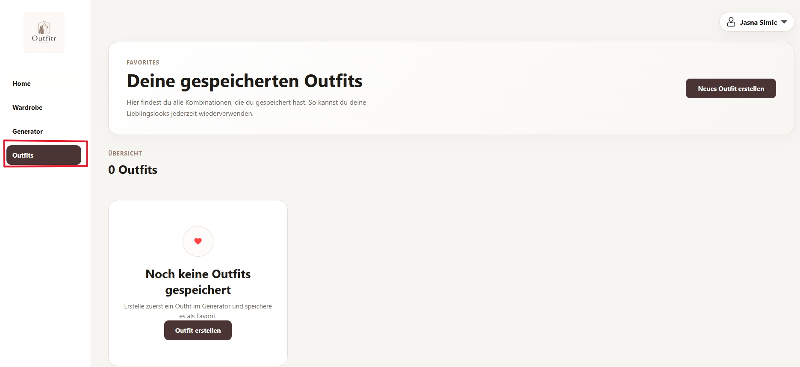

_Abbildung 22: Ursprüngliche Outfit-Ansicht ohne separate Favoriten-Funktion_

---

**Issue U2 – HTTP-500-Fehler beim Erstellen eines Kleidungsstücks**

Während der Evaluation trat auf der deployten Netlify-Version ein HTTP-500-Fehler beim Erstellen neuer Kleidungsstücke auf. Dadurch konnte der Upload-Prozess nicht erfolgreich abgeschlossen werden.

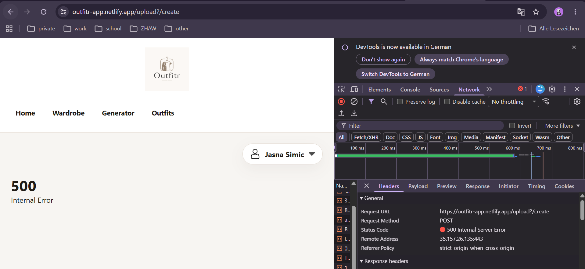

_Abbildung 23: Während der Evaluation identifizierter HTTP-500-Fehler beim Speichern eines Kleidungsstücks_

---

**Issue U3 – Bildvorschau verschwindet beim Abbrechen des Dateidialogs**

Beim Hochladen eines Bildes wurde beobachtet, dass die bereits ausgewählte Bildvorschau verschwand, wenn der Dateidialog erneut geöffnet und anschliessend abgebrochen wurde. Für Nutzer:innen ist dies irritierend, da der Eindruck entstehen kann, dass das Bild nicht mehr ausgewählt wurde.

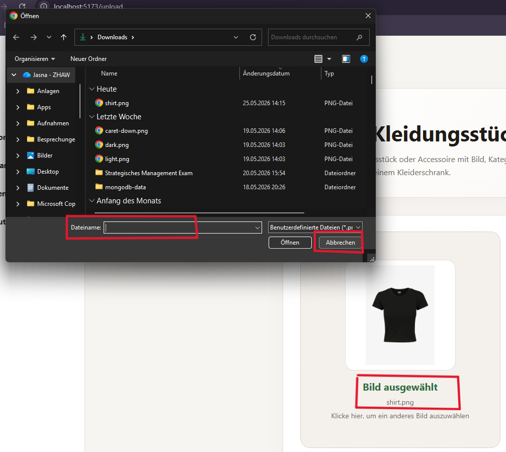

_Abbildung 24: Bildauswahl während des Upload-Prozesses_

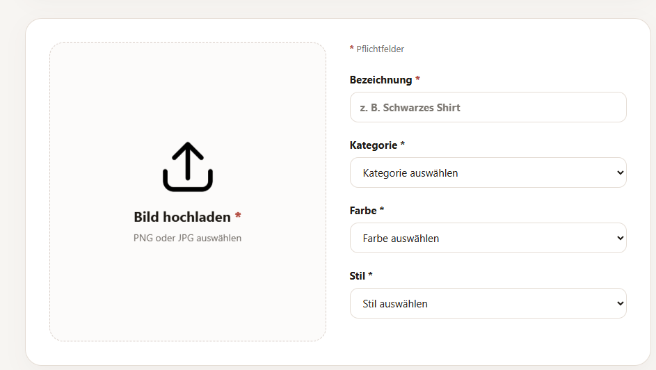

_Abbildung 25: Bildauswahl während des Upload-Prozesses_

---

**Issue U4 – Accessoires wurden im Dashboard nicht angezeigt**

Im Dashboard wurden Kleidungsstücke wie Shirts, Hosen und Schuhe angezeigt. Accessoires wurden jedoch nicht separat gezählt, obwohl diese in der Anwendung als optionale Ergänzung für Outfits vorgesehen sind. Dadurch war nicht vollständig sichtbar, welche Kleidungsarten bereits im digitalen Kleiderschrank vorhanden sind.

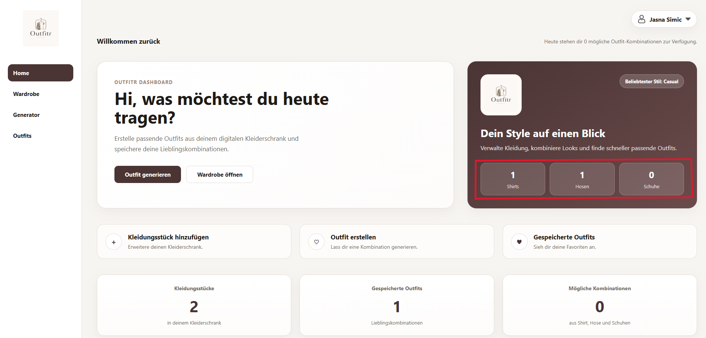

_Abbildung 26: Dashboard ohne separate Anzeige der gespeicherten Accessoires_

---

##### Positive Beobachtungen

Folgende Aspekte wurden von beiden Testpersonen positiv bewertet:

- Die Landing Page erklärt den Zweck der Anwendung verständlich.
- Die Sidebar-Navigation wurde sofort verstanden.
- Die Benutzeroberfläche wurde als modern und hochwertig wahrgenommen.
- Die Outfit-Generierung war intuitiv nutzbar.
- Die visuelle Darstellung der Kleidungsstücke wurde positiv bewertet.
- Die Dashboard-Seite vermittelte einen guten Überblick.
- Die Upload-Funktion wurde grundsätzlich als einfach verständlich beschrieben.
- Der Dark Mode wurde als angenehme Ergänzung wahrgenommen.
- Fehlermeldungen bei ungültigen Eingaben wurden verständlich dargestellt.
- Die Fehlermeldung bei fehlenden Kleidungsstücken für die Outfit-Generierung wurde korrekt angezeigt.

---

#### Zusammenfassung der Resultate

Die Evaluation zeigte, dass das Grundkonzept von Outfitr verständlich und benutzerfreundlich umgesetzt wurde. Besonders positiv bewertet wurden die Navigation, die visuelle Gestaltung sowie die einfache Bedienung des Outfit-Generators.

Gleichzeitig wurden mehrere Verbesserungspotenziale identifiziert. Neben einem technischen Problem beim Erstellen neuer Kleidungsstücke zeigte sich insbesondere, dass die Verwaltung gespeicherter Outfits für Nutzer:innen nicht eindeutig verständlich war. Zudem wurden kleinere Usability-Probleme bei der Bildauswahl sowie im Dashboard festgestellt.

Die zusätzlichen Tests zu Passwortvalidierung, fehlerhaften Eingaben, Profilmenü, Filterung und Dark Mode zeigten, dass die meisten Kernfunktionen der Anwendung zuverlässig und verständlich funktionieren.

---

#### Abgeleitete Verbesserungen

| Priorität | Verbesserung                                                       | Status    |
| --------- | ------------------------------------------------------------------ | --------- |
| Hoch      | Klare Trennung zwischen gespeicherten Outfits und Favoriten        | Umgesetzt |
| Hoch      | Behebung des HTTP-500-Fehlers beim Erstellen von Kleidungsstücken  | Umgesetzt |
| Mittel    | Beibehaltung der Bildvorschau nach Abbruch des Upload-Dialogs      | Umgesetzt |
| Niedrig   | Anzeige der Anzahl gespeicherter Accessoires im Dashboard ergänzen | Umgesetzt |

Die wichtigste Erkenntnis der Evaluation war die Notwendigkeit einer klareren Trennung zwischen gespeicherten Outfits und Lieblings-Outfits. Diese Verbesserung wurde nach der Evaluation umgesetzt und wird in Kapitel 4 dokumentiert.

Zusätzlich wurde der identifizierte HTTP-500-Fehler priorisiert behoben, da dieser eine zentrale Funktion der Anwendung beeinträchtigte. Die verbleibenden Verbesserungsvorschläge betreffen hauptsächlich Komfort- und Usability-Aspekte und können in zukünftigen Versionen umgesetzt werden.

## 4. Erweiterungen

Die folgenden Erweiterungen wurden zusätzlich zum definierten Mindestumfang umgesetzt. Sie dienen der Verbesserung der Benutzerfreundlichkeit, der Funktionalität sowie der technischen Qualität des Prototyps.

### 4.1 Dark Mode

#### Beschreibung & Nutzen

Für Outfitr wurde zusätzlich zum standardmässigen Light Mode ein vollständiger Dark Mode umgesetzt. Nutzer:innen können jederzeit zwischen beiden Darstellungsvarianten wechseln und die Anwendung an ihre persönlichen Vorlieben anpassen.

Die Erweiterung verbessert insbesondere die Nutzung bei schlechten Lichtverhältnissen und sorgt für eine modernere Benutzererfahrung. Gleichzeitig bietet sie den Nutzer:innen mehr Flexibilität bei der Darstellung der Anwendung.

Die Umsetzung erfolgte bewusst über den ursprünglichen Projektumfang hinaus, da viele moderne Webanwendungen und E-Commerce-Plattformen mittlerweile einen Dark Mode anbieten. Diese Funktion wurde daher als sinnvoller Mehrwert für Outfitr integriert.

---

#### Wo umgesetzt

##### Frontend

- Entwicklung eines vollständigen Dark-Mode-Designs für alle Seiten der Anwendung
- Anpassung von Farben, Hintergründen, Formularen, Karten, Buttons und Navigationselementen
- Umsetzung eines Theme-Toggles auf der Landing Page
- Integration einer Theme-Umschaltung im Profil-Dropdown innerhalb der Anwendung

##### State Management

- Speicherung des gewählten Themes im Browser mittels Local Storage
- Automatische Wiederherstellung des zuletzt gewählten Themes beim erneuten Öffnen der Anwendung

##### User Interface

- Unterstützung von Light Mode und Dark Mode auf allen zentralen Seiten
- Konsistente Farbgestaltung über Landing Page, Dashboard, Wardrobe, Generator und Outfits hinweg

---

#### Referenz

##### Landing Page – Light Mode

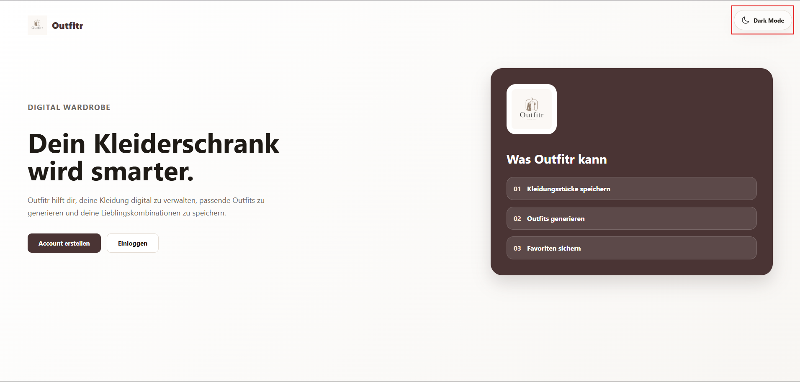

_Abbildung 27: Landing Page im Light Mode_

##### Landing Page – Dark Mode

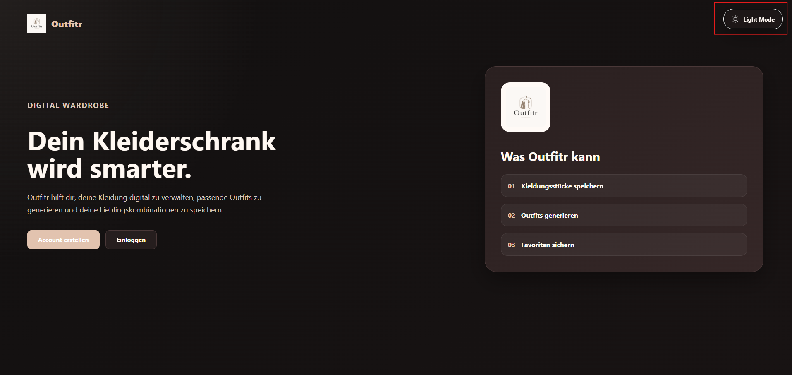

_Abbildung 28: Landing Page im Dark Mode_

##### Dashboard – Light Mode

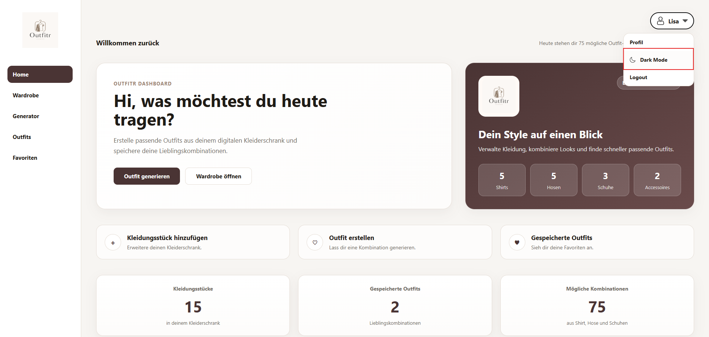

_Abbildung 29: Dashboard im Light Mode_

##### Dashboard – Dark Mode

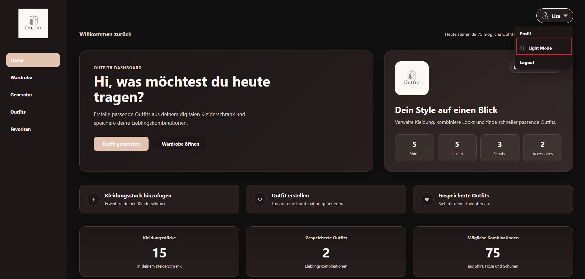

_Abbildung 30: Dashboard im Dark Mode_

Zusätzlich beschrieben in:

- Kapitel 3.4.1 Entwurf (Design)
- Kapitel 3.4.2 Umsetzung (Technik)

---

#### Aus Evaluation abgeleitet?

Nein. Der Dark Mode wurde bereits während der Entwicklung als zusätzliche Funktion geplant und umgesetzt. Die Erweiterung entstand aus eigenen Designüberlegungen sowie durch die Analyse moderner Webanwendungen und wurde nicht aufgrund von Erkenntnissen aus der Evaluation implementiert.

---

### 4.2 Favoriten-System

- **Beschreibung & Nutzen:**  
  Die Anwendung wurde um ein separates Favoriten-System erweitert. Nutzer:innen können gespeicherte Outfits zusätzlich als Favoriten markieren. Dadurch werden Lieblings-Outfits klar von normalen gespeicherten Outfits getrennt und können schneller wiedergefunden werden.

  Zusätzlich wurde die Favoriten-Funktion bewusst so umgesetzt, dass ein Outfit beim Entfernen aus den Favoriten nicht aus der Outfit-Verwaltung verschwindet. Wird das Herz-Symbol deaktiviert, bleibt das Outfit weiterhin in der Übersicht der gespeicherten Outfits sichtbar. Dadurch können Nutzer:innen versehentlich entfernte Favoriten jederzeit wieder als Favorit markieren, ohne das Outfit erneut erstellen zu müssen.

- **Wo umgesetzt:**
  - **Frontend:** Herz-Icon zur Markierung von Favoriten in der Outfit-Verwaltung
  - **Frontend:** Eigene Favoriten-Seite mit separater Darstellung der Lieblings-Outfits
  - **Frontend:** Dynamische Aktualisierung des Favoriten-Status in der Benutzeroberfläche
  - **Datenbank:** Speicherung des Favoriten-Status (`isFavorite`) innerhalb der Outfit-Dokumente in MongoDB
  - **Backend:** Separate Server-Action zum Hinzufügen und Entfernen von Favoriten

- **Referenz:**
  - Kapitel 3.4.1 Informationsarchitektur
  - Kapitel 3.5 Evaluation

- **Aus Evaluation abgeleitet?:**  
  Ja. Während der Evaluation wurde festgestellt, dass die ursprüngliche Outfit-Verwaltung nicht eindeutig zwischen gespeicherten Outfits und Lieblings-Outfits unterschied. Testpersonen äusserten den Wunsch nach einer klareren Trennung. Als Reaktion darauf wurde eine separate Favoriten-Seite eingeführt und die Favoriten-Verwaltung erweitert.

---

### 4.3 Accessoires als optionale Ergänzung

- **Beschreibung & Nutzen:**  
  Der Outfit-Generator wurde um die Kategorie **Accessoire** erweitert. Neben klassischen Kleidungsstücken wie Shirts, Hosen und Schuhen können Nutzer:innen nun zusätzliche Elemente wie Gürtel, Ketten, Taschen, Sonnenbrillen, Uhren, Mützen, Schals oder Ohrringe verwalten.

  Accessoires sind bewusst als optionale Ergänzung umgesetzt worden und stellen keinen Pflichtbestandteil eines Outfits dar. Dadurch bleiben die generierten Outfits flexibel, können aber bei vorhandenen Accessoires realistischer und vollständiger dargestellt werden.

  Zusätzlich wurde beim Hinzufügen eines neuen Accessoires ein weiteres Formularelement eingeführt. Nach der Auswahl der Kategorie **Accessoire** erscheint automatisch ein zusätzliches Auswahlfeld, über welches der genaue Accessoire-Typ definiert werden kann. Dadurch können verschiedene Accessoires strukturiert gespeichert, ausgewertet und später gezielt in Outfits integriert werden.

- **Wo umgesetzt:**
  - **Frontend:** Neue Kategorie „Accessoire“ in der Kleidungsverwaltung
  - **Frontend:** Dynamische Anzeige eines zusätzlichen Formularfeldes zur Auswahl des Accessoire-Typs
  - **Frontend:** Darstellung von Accessoires innerhalb generierter Outfits
  - **Frontend:** Berücksichtigung von Accessoires in den Dashboard-Statistiken
  - **Backend:** Erweiterung der Outfit-Logik zur optionalen Einbindung passender Accessoires
  - **Datenbank:** Erweiterung der MongoDB-Dokumente um das Attribut `accessoryType`

- **Referenz:**
  - Kapitel 3.3 End-to-End-Ablauf
  - Kapitel 3.4.1 Benutzeroberfläche und Informationsarchitektur
  - Abbildung X: Auswahl eines Accessoire-Typs beim Hinzufügen eines neuen Kleidungsstücks

- **Aus Evaluation abgeleitet?:**  
  Nein. Die Erweiterung entstand während der Weiterentwicklung der Anwendung. Bei der Analyse bestehender Mode- und Shopping-Plattformen zeigte sich, dass Accessoires einen wichtigen Bestandteil vollständiger Outfits darstellen. Die Funktion wurde deshalb ergänzt, um die erzeugten Outfit-Kombinationen realistischer und näher an realen Styling-Situationen abzubilden.

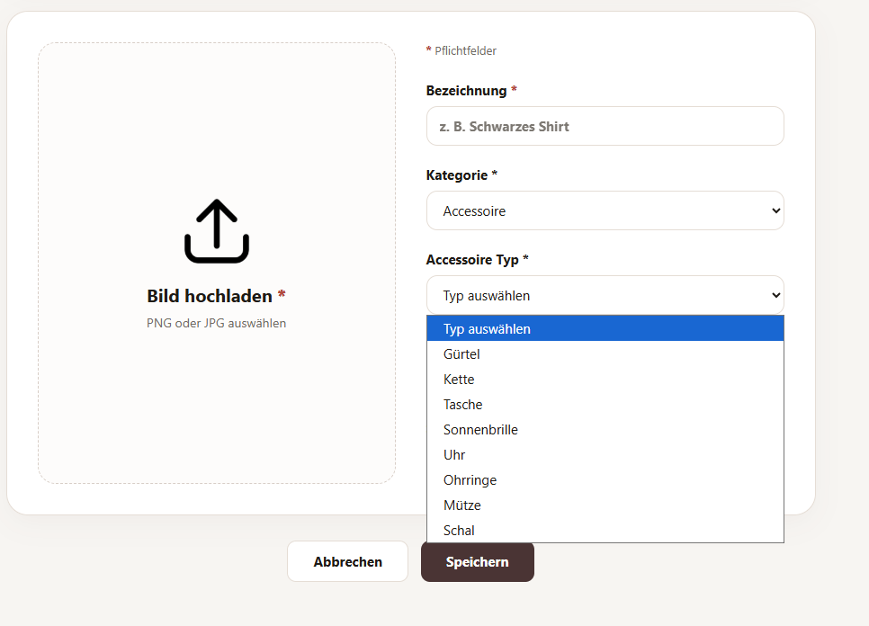

_Abbildung 31: Nach Auswahl der Kategorie „Accessoire“ wird automatisch ein zusätzliches Formularfeld eingeblendet, über welches der genaue Accessoire-Typ definiert werden kann. Dadurch können verschiedene Arten von Accessoires strukturiert gespeichert und später bei der Outfit-Generierung berücksichtigt werden._

---

### 4.4 Benutzerprofil und Kontoverwaltung

#### Beschreibung & Nutzen

Outfitr wurde um ein vollständiges Benutzerprofil mit Kontoverwaltung erweitert. Nutzer:innen können ein eigenes Benutzerkonto erstellen, sich anmelden, ihre Profildaten verwalten sowie ihr Passwort ändern.

Durch die Benutzerverwaltung können persönliche Kleidungsstücke, Outfits und Favoriten dauerhaft gespeichert werden. Die Anwendung bietet dadurch eine individuellere Nutzung als ein rein statischer Prototyp.

Zusätzlich erhöht die Passwortänderung die Kontrolle über das eigene Benutzerkonto und verbessert die Benutzerfreundlichkeit der Anwendung.

---

#### Wo umgesetzt

##### Frontend

- Registrierungsseite zur Erstellung neuer Benutzerkonten
- Login-Seite für die Authentifizierung bestehender Nutzer:innen
- Profilseite zur Verwaltung persönlicher Daten
- Formular zur Änderung des Passworts
- Logout-Funktion innerhalb des Profilmenüs

##### Backend

- Benutzerverwaltung über Server Actions
- Passwortvalidierung bei Registrierung und Passwortänderung
- Session-Management für angemeldete Nutzer:innen

##### Datenbank

- Speicherung von Benutzerdaten in MongoDB
- Verknüpfung von Kleidungsstücken, Outfits und Favoriten mit dem jeweiligen Benutzerkonto

---

#### Referenz

- Kapitel 3.4.2 Umsetzung
- Kapitel 3.5 Evaluation (Login-, Registrierungs- und Passworttests)

---

#### Aus Evaluation abgeleitet?

Nein. Die Benutzerverwaltung wurde bereits während der Entwicklung als zusätzliche Funktion geplant, um eine realistische Nutzung der Anwendung mit individuellen Benutzerkonten zu ermöglichen.

---

### 4.5 Dashboard mit Live-Statistiken

#### Beschreibung & Nutzen

Das Dashboard wurde um verschiedene dynamische Statistiken erweitert, die den Inhalt des persönlichen Kleiderschranks automatisch auswerten.

Nutzer:innen erhalten dadurch einen schnellen Überblick über ihre gespeicherten Kleidungsstücke, Outfits und möglichen Outfit-Kombinationen. Zusätzlich werden Informationen über die Verteilung der verschiedenen Kleidungskategorien angezeigt.

Die Erweiterung unterstützt die Nutzer:innen dabei, ihren digitalen Kleiderschrank besser zu verstehen und ungenutzte Potenziale zu erkennen.

Die folgenden Kennzahlen werden automatisch berechnet und dargestellt:

- Anzahl Shirts
- Anzahl Hosen
- Anzahl Schuhe
- Anzahl Accessoires
- Anzahl gespeicherter Outfits
- Anzahl möglicher Outfit-Kombinationen

---

#### Wo umgesetzt

##### Frontend

- Dashboard mit mehreren Statistik-Karten
- Visuelle Darstellung der wichtigsten Kennzahlen
- Automatische Aktualisierung nach Änderungen im Kleiderschrank

##### Backend

- Berechnung der Statistiken auf Basis der gespeicherten Daten
- Dynamische Ermittlung möglicher Outfit-Kombinationen

##### Datenbank

- Auswertung der gespeicherten Kleidungsstücke und Outfits
- Berücksichtigung von Shirts, Hosen, Schuhen und Accessoires

---

#### Referenz

- Kapitel 3.4.1 Benutzeroberfläche
- Kapitel 3.4.2 Umsetzung

##### Dashboard mit Live-Statistiken

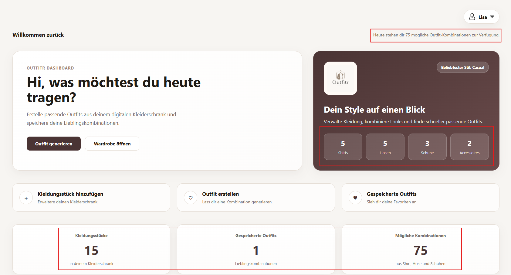

_Abbildung 32: Dynamische Auswertung des digitalen Kleiderschranks mit Anzahl Kleidungsstücke, Accessoires, gespeicherten Outfits und möglichen Outfit-Kombinationen._

---

#### Aus Evaluation abgeleitet?

Nein. Die Erweiterung wurde implementiert, um den Nutzer:innen zusätzliche Informationen über ihren digitalen Kleiderschrank bereitzustellen und die Anwendung interaktiver zu gestalten.

---

### 4.6 Dynamische Outfit-Generierung und Duplikat-Erkennung

#### Beschreibung & Nutzen

Eine zentrale Erweiterung von Outfitr ist die dynamische Outfit-Generierung. Die Anwendung erstellt Outfits nicht aus vordefinierten Beispielen, sondern generiert diese auf Basis der tatsächlich gespeicherten Kleidungsstücke eines Nutzers bzw. einer Nutzerin.

Dadurch entstehen individuelle Outfit-Kombinationen, die direkt auf dem persönlichen digitalen Kleiderschrank basieren. Die Funktion bietet einen konkreten Mehrwert gegenüber einer statischen Anzeige von Kleidungsstücken und bildet die Kernfunktion der Anwendung.

Zusätzlich wurde eine Duplikat-Erkennung implementiert. Bereits gespeicherte Outfit-Kombinationen können nicht mehrfach gespeichert werden. Dadurch bleibt die Outfit-Verwaltung übersichtlich und redundante Einträge werden vermieden.

---

#### Funktionsweise der Outfit-Generierung

Die Outfit-Generierung basiert auf einer regelbasierten Logik.

Für die Erstellung eines Outfits werden die gespeicherten Kleidungsstücke des aktuell angemeldeten Benutzers analysiert.

Dabei gelten folgende Regeln:

- Mindestens ein Shirt muss vorhanden sein.
- Mindestens eine Hose muss vorhanden sein.
- Mindestens ein Paar Schuhe muss vorhanden sein.
- Accessoires sind optional und werden nur berücksichtigt, wenn passende vorhanden sind.

Die Anwendung erstellt mögliche Kombinationen aus den vorhandenen Kategorien und berechnet daraus die verfügbaren Outfit-Kombinationen.

Beispiel:

- 5 Shirts
- 5 Hosen
- 3 Schuhe

Ergeben:

5 × 5 × 3 = 75 mögliche Outfit-Kombinationen

Sind zusätzlich Accessoires vorhanden, können diese dem Outfit ergänzend hinzugefügt werden.

Falls eine der benötigten Hauptkategorien fehlt, wird kein Outfit generiert und die Nutzer:innen erhalten eine verständliche Fehlermeldung.

---

#### Wo umgesetzt

##### Frontend

- Generator-Seite zur Erstellung neuer Outfit-Kombinationen
- Anzeige der generierten Outfit-Vorschläge
- Rückmeldungen bei erfolgreichem Speichern
- Fehlermeldungen bei fehlenden Kleidungsstücken
- Meldung bei bereits gespeicherten Outfits

##### Backend

- Logik zur Auswahl passender Kleidungsstücke
- Prüfung der erforderlichen Kategorien
- Berechnung möglicher Outfit-Kombinationen
- Duplikat-Prüfung vor dem Speichern

##### Datenbank

- Speicherung generierter Outfits in MongoDB
- Vergleich bestehender Outfit-Dokumente zur Vermeidung von Duplikaten

---

#### Referenz

- Kapitel 3.3 End-to-End-Ablauf
- Kapitel 3.4.2 Umsetzung

##### Outfit-Generierung

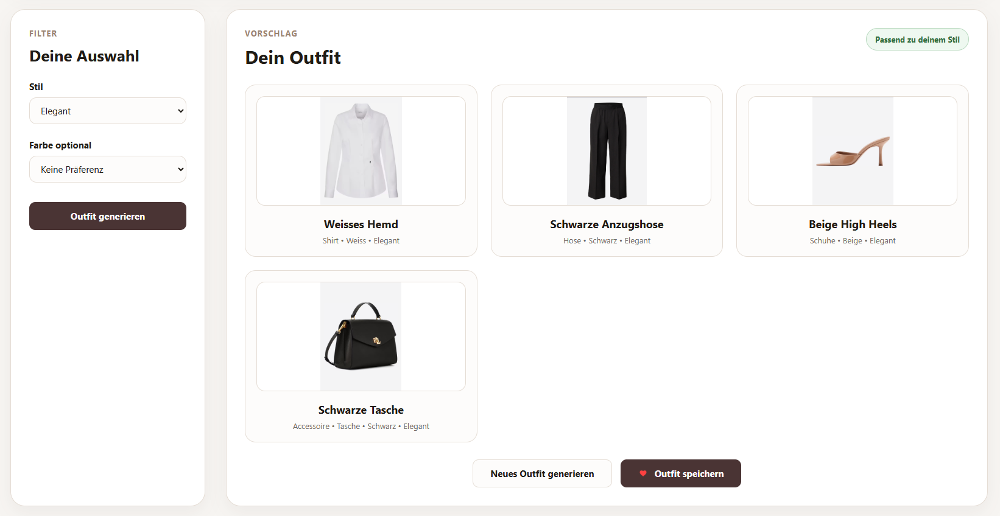

_Abbildung 33: Dynamisch generiertes Outfit basierend auf den gespeicherten Kleidungsstücken des Benutzers._

##### Duplikat-Erkennung

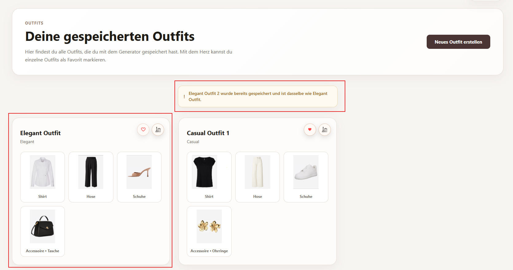

_Abbildung 34: Meldung beim Versuch, ein bereits gespeichertes Outfit erneut zu speichern._

---

#### Aus Evaluation abgeleitet?

Nein. Die Outfit-Generierung stellt die zentrale Kernfunktion von Outfitr dar und wurde bereits zu Beginn der Entwicklung geplant. Die spätere Duplikat-Erkennung wurde ergänzend implementiert, um die Benutzerfreundlichkeit zu verbessern und doppelte Outfit-Einträge zu vermeiden.

---

# 5. Projektorganisation

## 5.1 Repository & Struktur

Für die Entwicklung von Outfitr wurde GitHub als zentrales Repository verwendet. Der gesamte Quellcode, die Projektdokumentation sowie die Versionsverwaltung befinden sich in diesem Repository.

**GitHub Repository:**  
https://github.com/simicjasna/outfitr

Die Projektstruktur wurde modular aufgebaut. Ziel war es, Seiten, wiederverwendbare Komponenten, serverseitige Logik, statische Dateien und Dokumentationsmaterial klar voneinander zu trennen. Dadurch bleibt das Projekt übersichtlich und spätere Erweiterungen können einfacher umgesetzt werden.

### Projektstruktur

```text
outfitr/
│
├── .vscode/                    # Editor- und Workspace-Einstellungen
│
├── doc/
│   └── images/                 # Screenshots und Abbildungen für die Projektdokumentation
│
├── src/
│   ├── lib/                    # Wiederverwendbare Bestandteile der Anwendung
│   │   ├── assets/             # Assets innerhalb der Anwendung
│   │   ├── components/         # Wiederverwendbare UI-Komponenten
│   │   ├── constants/          # Zentrale Konstanten
│   │   ├── server/             # Serverseitige Logik
│   │   └── index.ts
│   │
│   ├── routes/                 # Seiten und SvelteKit-Routen
│   │   ├── dashboard/
│   │   ├── favorites/
│   │   ├── generator/
│   │   ├── login/
│   │   ├── logout/
│   │   ├── outfits/
│   │   ├── profile/
│   │   ├── register/
│   │   ├── upload/
│   │   ├── wardrobe/
│   │   ├── +layout.server.js
│   │   ├── +layout.svelte
│   │   ├── +page.server.js
│   │   ├── +page.svelte
│   │   ├── home.css
│   │   └── landing.css
│   │
│   ├── app.css
│   ├── app.d.ts
│   ├── app.html
│   └── hooks.server.js
│
├── static/                     # Bilder, Icons und statische Dateien
│
├── .gitignore
├── .npmrc
├── README.md
├── netlify.toml
├── package-lock.json
├── package.json
├── svelte.config.js
├── tsconfig.json
└── vite.config.ts
```

Die wichtigsten Anwendungsbereiche befinden sich im Ordner `src/routes`. Jede Hauptfunktion der Anwendung wurde als eigene Route umgesetzt. Wiederverwendbare Komponenten und Hilfsfunktionen wurden im Ordner `src/lib` organisiert. Screenshots und Dokumentationsbilder befinden sich separat im Ordner `doc/images`.

---

## 5.2 Issue-Management

Für dieses Projekt wurde kein separates Issue-Tracking-System verwendet.

Die Planung und Priorisierung der Arbeiten erfolgte iterativ während der Entwicklung. Neue Anforderungen entstanden sowohl aus eigenen Ideen als auch aus Erkenntnissen während der Evaluation.

Identifizierte Probleme und Verbesserungsvorschläge wurden direkt umgesetzt oder für spätere Entwicklungsphasen dokumentiert. Beispiele hierfür sind:

- Einführung eines separaten Favoriten-Systems
- Erweiterung um Accessoires
- Verbesserung der Upload-Funktion
- Behebung des HTTP-500-Fehlers beim Erstellen von Kleidungsstücken
- Ergänzung der Dashboard-Statistiken
- Verbesserung der Benutzerführung innerhalb der Anwendung

Durch die überschaubare Projektgrösse konnte auf ein formales Issue-Management verzichtet werden.

---

## 5.3 Commit-Praxis

Für die Versionsverwaltung wurde Git verwendet. Sämtliche Änderungen wurden regelmässig in kleinen, nachvollziehbaren Commits gespeichert.

Die Commit-Nachrichten folgen einem einheitlichen Schema:

```text
typ(Bereich): kurze Beschreibung
```

Beispiele aus dem Projekt:

https://github.com/simicjasna/outfitr/commits/main/

```text
feat(User Login): add user account functionality
feat(Deployment): setup netlify deployment
feat(Accessory): add option to add Accessoires
feat(Favorites): add new fav logic

fix(Login): fix 404
fix(Upload): not losing selected image
fix(Home): display Accessoires

refactor(Menu): close dropdown after clicking
refactor(Dark Mode): add functionality to landingpage and modify dashboard display

polish(Favorites): remove delete action
polish(Documentation): finalize chapter 4
```

Die verwendeten Commit-Typen haben folgende Bedeutung:

| Typ        | Bedeutung                                |
| ---------- | ---------------------------------------- |
| `feat`     | Neue Funktion oder Erweiterung           |
| `fix`      | Fehlerbehebung                           |
| `refactor` | Überarbeitung bestehender Funktionalität |
| `polish`   | Visuelle oder qualitative Verbesserung   |

Durch diese Struktur bleibt die Entwicklungshistorie übersichtlich und nachvollziehbar. Änderungen können schnell identifiziert und bestimmten Funktionsbereichen zugeordnet werden.

---

# 6. KI-Deklaration

## 6.1 KI-Tools

### Eingesetzte Tools

| Tool           | Version / Variante | Zweck                                                                                     |
| -------------- | ------------------ | ----------------------------------------------------------------------------------------- |
| ChatGPT        | GPT-5.5            | Unterstützung bei Dokumentation, CSS, Debugging, Architekturideen und SvelteKit-Problemen |
| GitHub Copilot | –                  | Inline-Codevorschläge und Autovervollständigung im Editor                                 |
| Claude         | Claude Sonnet      | Teilweise Unterstützung bei Formulierungen und Strukturideen                              |

### Zweck & Umfang

Die KI-Tools wurden während des Projekts unterstützend eingesetzt, insbesondere bei technischen Fragestellungen, Debugging, CSS-Anpassungen sowie bei der sprachlichen Überarbeitung der Dokumentation.

Folgende Bereiche wurden mit KI-Unterstützung bearbeitet:

- Unterstützung bei der Entwicklung mit SvelteKit
- CSS-Optimierungen für Light- und Dark-Mode
- Unterstützung bei der Fehlersuche und Fehleranalyse
- Vorschläge für Komponentenstruktur und Routing
- Unterstützung bei Refactorings bestehender Funktionen
- Unterstützung bei der Formulierung und Strukturierung der Projektdokumentation
- Unterstützung bei technischen Beschreibungen und Erklärungen

Teilweise KI-unterstützt entstanden insbesondere:

- Dark-Mode-Implementierung
- Dropdown- und Navigationslogik
- Upload- und Formularlogik
- CSS-Optimierungen und Layout-Anpassungen
- Technische Dokumentation und Kapitelstruktur

### Eigene Leistung (Abgrenzung)

Die Projektidee, die Konzeption sowie die gesamte funktionale Umsetzung der Anwendung wurden eigenständig entwickelt.

Eigenständig erarbeitet wurden insbesondere:

- Die Idee und Zielsetzung der Anwendung Outfitr
- Die gesamte Anforderungsanalyse
- Die Informationsarchitektur
- Die Benutzerführung (User Flow)
- Die Navigationsstruktur
- Das Designkonzept und die Farbgestaltung
- Die Datenmodellierung in MongoDB
- Die Entwicklung und Verknüpfung der einzelnen Seiten
- Die Umsetzung der Kernfunktionen
- Die Outfit-Generierungslogik
- Das Favoriten-System
- Die Accessoire-Erweiterung
- Das Dashboard mit Statistiken
- Die Benutzerverwaltung
- Die Planung, Durchführung und Auswertung der Evaluation
- Die Erstellung der Testfälle
- Die Analyse der Evaluationsergebnisse
- Die finale Überarbeitung sämtlicher Dokumentationsinhalte

KI-generierte Vorschläge wurden nicht ungeprüft übernommen. Sämtliche Vorschläge wurden getestet, angepasst und in die bestehende Architektur integriert.

---

## 6.2 Prompt-Vorgehen

Der Einsatz von KI erfolgte iterativ und problemorientiert. Typischerweise wurde zunächst das bestehende Problem, die gewünschte Funktion oder ein konkreter Codeabschnitt beschrieben. Anschliessend wurden gezielt Lösungsvorschläge angefordert.

Das Vorgehen bestand meist aus folgenden Schritten:

1. Beschreibung des Problems oder der gewünschten Funktion
2. Bereitstellung von bestehendem Code oder Screenshots
3. Generierung möglicher Lösungsansätze durch KI
4. Testen der vorgeschlagenen Lösung innerhalb des Projekts
5. Anpassung und Überarbeitung der Resultate
6. Integration der finalen Lösung in die Anwendung

Beispiele für typische Fragestellungen:

- Debugging von SvelteKit-Fehlern
- Umsetzung des Dark Modes
- Optimierung von CSS und Responsiveness
- Verbesserung von Formularen und Benutzerführung
- Unterstützung bei MongoDB-Abfragen
- Strukturierung der Projektdokumentation
- Formulierung technischer Beschreibungen

Für die Dokumentation wurden zunächst eigene Inhalte, Stichpunkte und Erkenntnisse erarbeitet. Anschliessend wurden diese mit Unterstützung von KI sprachlich überarbeitet und strukturiert formuliert.

Bei der Nutzung von KI wurde darauf geachtet, keine urheberrechtlich geschützten Inhalte ungeprüft zu übernehmen. Verwendete Bilder, Icons und Logos stammen aus eigenen oder frei nutzbaren Quellen.

---

## 6.3 Reflexion

### Nutzen

Der Einsatz von KI erwies sich insbesondere bei technischen Fragestellungen als hilfreich.

Vorteile waren:

- Schnellere Fehlersuche
- Unterstützung bei CSS-Anpassungen
- Hilfe bei komplexeren SvelteKit-Problemen
- Schnellere Umsetzung von UI-Ideen
- Unterstützung bei Refactorings
- Unterstützung bei der sprachlichen Ausarbeitung der Dokumentation

Insbesondere bei der Umsetzung des Dark Modes, der Upload-Funktion, der Navigation sowie bei der Dokumentation konnte Zeit eingespart werden.

### Grenzen

Nicht alle Vorschläge waren direkt verwendbar. Teilweise mussten generierte Lösungen angepasst oder vollständig überarbeitet werden.

Insbesondere bei:

- SvelteKit-spezifischen Problemen
- Datenbankzugriffen
- Formularlogik
- State-Management
- Routing

waren zusätzliche eigene Anpassungen notwendig.

Auch Designentscheidungen, Architekturfragen und die Benutzerführung konnten nicht vollständig an KI delegiert werden, da hierfür ein eigenes Verständnis der Anwendung erforderlich war.

Die Evaluation selbst wurde eigenständig geplant, durchgeführt und ausgewertet. Die Testfälle, die Auswahl der Testpersonen sowie die Interpretation der Ergebnisse stammen von der Projektverfasserin.

### Risiken und Qualitätssicherung

Alle KI-generierten Inhalte wurden manuell überprüft, getestet und validiert.

Besondere Aufmerksamkeit galt dabei folgenden Bereichen:

- Formularvalidierung
- Benutzerverwaltung
- Routing
- Outfit-Generierung
- Datenbankzugriffe
- Upload-Funktion
- Favoriten-System
- Dashboard-Statistiken

Fehlerhafte oder ungeeignete Vorschläge wurden verworfen oder angepasst.

Die finale Verantwortung für Code, Design, Evaluation und Dokumentation lag jederzeit bei der Projektverfasserin.

# 7. Anhang

## 7.1 Quellen & Abhängigkeiten

### Frameworks & Technologien

| Ressource     | Verwendung           | Lizenz    |
| ------------- | -------------------- | --------- |
| SvelteKit     | Web Framework        | MIT       |
| MongoDB Atlas | Datenbank            | Free Tier |
| Netlify       | Hosting & Deployment | Free Tier |
| GitHub        | Versionsverwaltung   | Free Tier |
| Vite          | Build Tool           | MIT       |
| Node.js       | JavaScript Runtime   | MIT       |

### KI-Unterstützung

| Tool              | Verwendung                                            |
| ----------------- | ----------------------------------------------------- |
| ChatGPT (GPT-5.5) | Dokumentation, Debugging und technische Unterstützung |
| GitHub Copilot    | Codevorschläge und Autovervollständigung              |
| Claude Sonnet     | Formulierungs- und Strukturvorschläge                 |

---

## 7.2 Verwendete Bilder & Assets

| Ressource    | Verwendung                                 | Quelle                   |
| ------------ | ------------------------------------------ | ------------------------ |
| UI-Icons     | Navigation, Buttons und Benutzeroberfläche | https://www.flaticon.com |
| Outfitr Logo | Anwendung und Dokumentation                | Eigenständig erstellt    |
| Mockups      | Prototyping und Dokumentation              | Eigenständig erstellt    |
| Screenshots  | Dokumentation und Evaluation               | Eigenständig erstellt    |

---

## 7.3 Testmaterialien

Die vollständigen Testfälle sowie die Auswertung der Evaluation befinden sich in Kapitel 3.5.

Getestete Hauptfunktionen:

- Registrierung
- Login
- Profilverwaltung
- Passwortänderung
- Kleidungsstücke hinzufügen
- Kleidungsstücke bearbeiten
- Kleidungsstücke löschen
- Outfit-Generierung
- Outfit-Speicherung
- Favoriten-System
- Dashboard-Statistiken
- Dark Mode
- Navigation und Benutzerführung

---

## 7.4 Deployment

| Bereich    | Information                           |
| ---------- | ------------------------------------- |
| Plattform  | Netlify                               |
| Live-URL   | https://outfitr-app.netlify.app/      |
| Repository | https://github.com/simicjasna/outfitr |

---

## 7.5 Lokale Entwicklung

### Abhängigkeiten installieren

```bash
npm install
```

### Entwicklungsserver starten

```bash
npm run dev
```

### Produktions-Build erstellen

```bash
npm run build
```

---

## 7.6 Umgebungsvariablen

Die Anwendung verwendet Umgebungsvariablen für die Verbindung mit MongoDB Atlas.

Beispiel:

```env
MONGODB_URI=...
```

Die tatsächlichen Zugangsdaten wurden aus Sicherheitsgründen nicht veröffentlicht.
